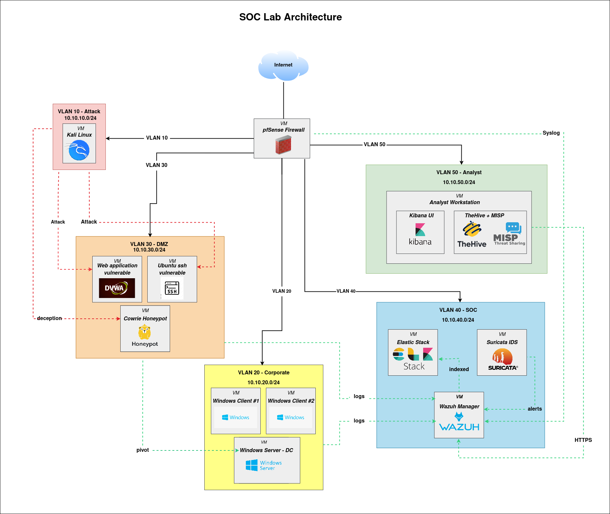

# 🛡️ Home SOC Lab - Purple Team SIEM Environment


> A fully virtualized Security Operations Center (SOC) lab built from scratch to learn, demonstrate, and operate end-to-end detection capabilities, from log ingestion to incident response, with realistic attack surfaces and honeypots.

**Started:** May 2026 | **Author:** Anass CHAMMAMI - Master 1 Cybersecurity, UGA IM2AG

---

## 📌 Project context

This project is conducted as part of the **TER (Travaux d'Études et de Recherche)** at the University Grenoble Alpes (IM2AG) under the "Entreprise" formula, oriented towards an M2 work-study program in cybersecurity.

The goal is to **build, operate and document a complete SOC environment**, mirroring real-world enterprise architectures, in order to develop hands-on skills equivalent to a junior SOC analyst internship.

## 🎯 Objectives

- Deploy a **realistic enterprise-like network** (segmented VLANs, Active Directory, DMZ with exposed services)
- Centralize and analyze logs through a **production-grade SIEM stack** (Wazuh + Elastic)
- Detect attacks using **MITRE ATT&CK-mapped** rules and scenarios
- Simulate **realistic full-chain attacks** (web → pivot → AD → exfiltration) using a Purple Team approach
- Integrate **honeypots and deception** for threat detection
- Document everything as if it were a professional engagement

## 🏗️ Architecture overview



| Zone        | Components                                                   | Purpose                              |
|-------------|--------------------------------------------------------------|--------------------------------------|
| VLAN 10     | Kali Linux (10.10.10.51) , Caldera, Atomic Red Team          | Adversary emulation                  |
| VLAN 20     | Windows Server 2022 (AD DC), 2× Windows 10 clients           | Corporate environment (target)       |
| VLAN 30     | DVWA (10.10.30.50), vulnerable Ubuntu (SSH), Cowrie honeypot | DMZ, exposed services + deception    |
| VLAN 40     | Wazuh manager (10.10.40.50), Elasticsearch, Kibana           | SOC stack                            |
| VLAN 50     | Analyst workstation (10.10.50.50), TheHive, MISP (optional)  | Investigation and case management    |

> 📐 **Detailed architecture** — see [docs/01-architecture.md](docs/01-architecture.md)
> for IP plan, VLAN breakdown, software stack, flows matrix, and design rationale.

## 🧰 Tech stack

**Hypervisor:** Proxmox VE 9.1.7 (UGA IM2AG infrastructure) <br>
**Firewall / Router:** pfSense CE 2.7.2<br>
**SIEM:** Wazuh 4.14.5 All-in-One (Manager + Indexer + Dashboard) <br>
**Network IDS:** Suricata (pfSense package) with ETOpen ruleset<br>
**Endpoint visibility:** Sysmon (with SwiftOnSecurity config) + Wazuh agent<br>
**Vulnerable targets:** DVWA (web, Docker), OpenSSH on port 2200 (weak credentials)<br>
**Honeypot:** Cowrie SSH honeypot on port 22 (Docker)<br>
**Adversary emulation:** Atomic Red Team, MITRE Caldera, Hydra, Impacket, BloodHound<br>
**Case management (bonus):** TheHive 5<br>
**Threat intel (bonus):** MISP<br>
**SOAR (bonus):** Shuffle<br>

## 🎯 Detection coverage (MITRE ATT&CK)

| Tactic             | Technique                          | Detection source              | Status |
|--------------------|------------------------------------|-------------------------------|--------|
| Reconnaissance     | T1595 — Active Scanning            | Suricata + pfSense logs       | ✅ Done (scenario 01) |
| Initial Access     | T1190 — Exploit Public App (DVWA)  | Suricata + Wazuh custom rule          | ✅ Done (scenario 03) |
| Credential Access     | T1110 — SSH Brute Force            | Wazuh auth.log + Cowrie       | ✅ Done (scenario 02) |
| Initial Access          | T1078 — Valid Accounts (honeypot)              | Cowrie → Wazuh                | ✅ Done (scenario 02) |
| Deception          | Honeypot interaction               | Cowrie → Wazuh                | ✅ Done (scenario 02) |
| Execution          | T1059 — Command/Scripting (Cowrie)            | Cowrie command capture               | ✅ Done (scenario 02) |
| Execution          | T1059.004 — Unix Shell (web shell) | Wazuh process monitoring      | 🔜 Planned (scenario 04) |
| Credential Access  | T1110 — RDP / SMB Brute Force      | Windows Event 4625            | 🗓️ Future work (AD scope) |
| Credential Access  | T1558.003 — Kerberoasting          | Windows Event 4769            | 🗓️ Future work (AD scope) |
| Lateral Movement   | T1021 — Remote Services (PsExec)   | Sysmon + Wazuh                | 🗓️ Future work (AD scope) |
| Persistence        | T1136 — Create Account             | Event 4720                    | 🗓️ Future work (AD scope) |
| Defense Evasion    | T1070.001 — Clear Windows logs     | Event 1102                    | 🗓️ Future work (AD scope) |
| Exfiltration       | T1041 — Exfiltration over C2              | Suricata                      | 🗓️ Future work |
| C2                 | T1071.001 — Web protocols          | Suricata               | 🗓️ Future work |

## 🎭 Attack scenarios (Purple Team)

The lab implements **8 end-to-end attack scenarios**, each executed and then detected/investigated as a SOC analyst:

1. **External reconnaissance** — Nmap port and service scan against DMZ
2. **SSH brute force** against the vulnerable Ubuntu, with parallel Cowrie honeypot comparison
3. **DVWA SQL injection** leading to data exfiltration
4. **DVWA RCE → web shell** persistence on the web server
5. **DMZ → Corp pivot** via stolen SSH key
6. **Active Directory reconnaissance** with BloodHound from a compromised endpoint
7. **Kerberoasting** against a service account
8. **Full kill chain** combining 6 of the above into one realistic intrusion

Each scenario has its own report in `docs/04-attack-scenarios/` with: attack steps, detection rules triggered, MITRE mapping, screenshots, and a responder playbook.

## 📂 Repository structure

```
soc-lab/
├── README.md                          # this file
├── docs/
│   ├── 01-architecture.md             # detailed architecture and IP plan
│   ├── 02-detection-strategy.md       # SOC detection philosophy and MITRE coverage
│   ├── 03-installation/               # step-by-step setup per component
│   ├── 04-detection-rules.md          # all custom detection rules
│   ├── 05-attack-scenarios/           # 8 scenarios, one report each
│   ├── 06-dashboards.md               # Kibana SOC dashboard exports
│   ├── 07-playbooks/                  # IR playbooks for each detection
│   └── journal.md                     # daily logbook
├── configs/
│   ├── pfsense/                       # firewall rules, VLAN config
│   ├── wazuh/                         # custom rules, decoders, agent config
│   ├── sysmon/                        # Sysmon configuration
│   └── suricata/                      # custom rules
├── scripts/
│   ├── deploy/                        # automation scripts (PowerShell / Bash)
│   └── attack-simulation/             # attack scripts (Atomic / custom)
├── diagrams/                          # architecture diagrams 
│   └── soc-lab-architecture.png
└── reports/
    └── final-report.md                
```

## 📅 Roadmap

| Week | Dates       | Phase                | Key milestone                              |
|------|-------------|----------------------|--------------------------------------------|
| W1   | 12–17 May   | Build infrastructure | Lab deployed, network segmented, AD live   |
| W2   | 18–24 May   | Detection layer      | Wazuh ingesting all logs, 10+ rules active |
| W3   | 25–31 May   | Attack & investigate | Linux attack scenarios executed and documented       |
| W4   | 1–8 June    | Deliverables         | Video + report + presentation ready        |
|      | 9 June      | Defense              | TER soutenance                             |

## 📊 Key metrics

- Custom detection rules written: `10` (Cowrie 100100–100105, Suricata 100200–100203)
- MITRE ATT&CK techniques covered: `5` (T1595, T1190, T1110/T1110.001, T1078, T1059)
- Attack scenarios fully documented: `3 / 8`
- Detection layers operational: `3` (HIDS Wazuh agent, NIDS Suricata ×2, deception Cowrie)

## 📚 Documentation philosophy

Every component is documented as if a **new SOC analyst joins the team tomorrow** and needs to understand:

1. **Why** it is there (threat model)
2. **How** it was deployed (reproducible steps)
3. **What** it detects (mapped to MITRE)
4. **How to respond** (runbook / playbook)

## 🎓 Learning resources

- MITRE ATT&CK — https://attack.mitre.org/
- Wazuh documentation — https://documentation.wazuh.com/
- Sigma rules repository — https://github.com/SigmaHQ/sigma
- Atomic Red Team — https://atomicredteam.io/

## ⚠️ Disclaimer

All offensive content (DVWA, vulnerable SSH, attack scripts) is hosted in a **fully isolated virtual environment** with no external exposure. The lab is for educational purposes within the framework of an academic project.

## 👤 Contact

[](mailto:anasschammami04@gmail.com) [](https://www.linkedin.com/in/anass-chammami-78ab25304/)