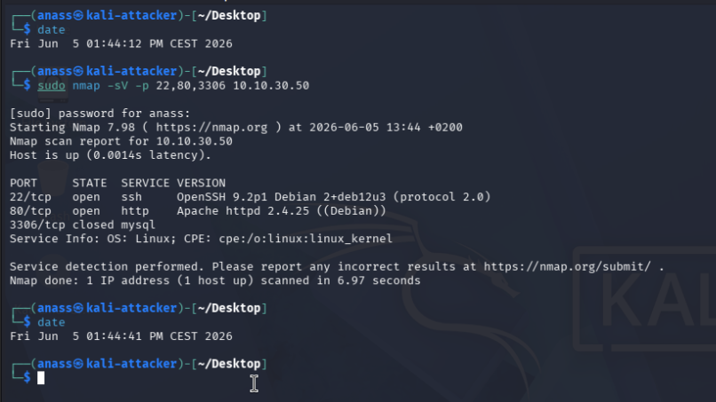
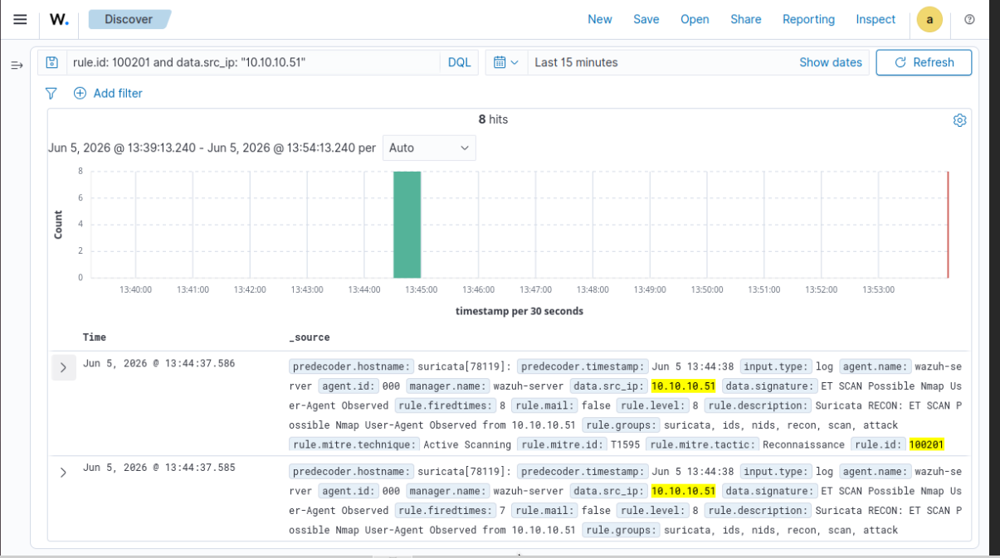
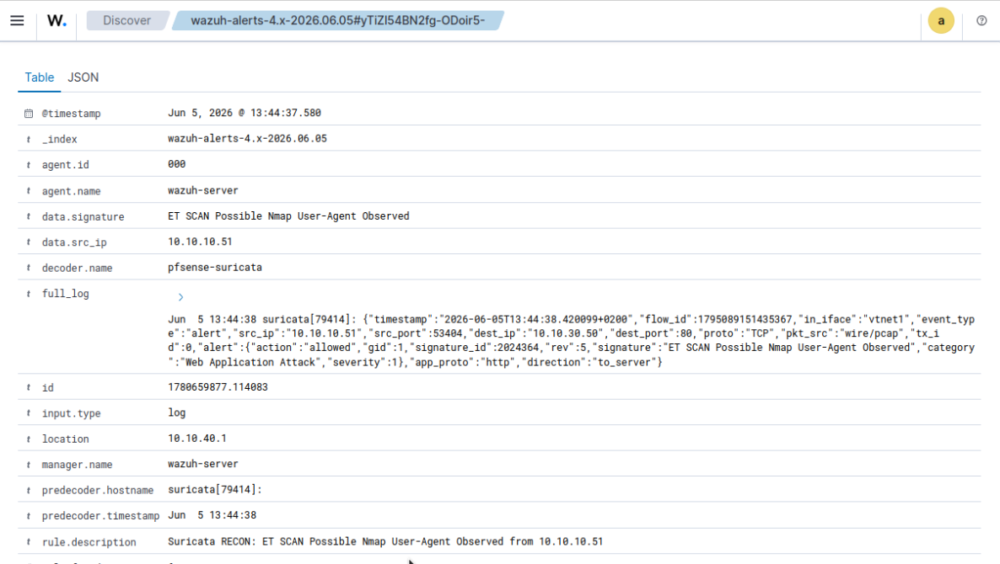
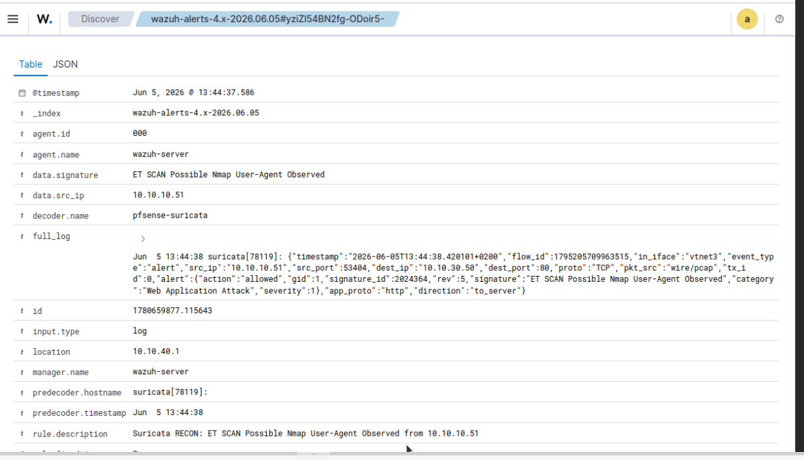
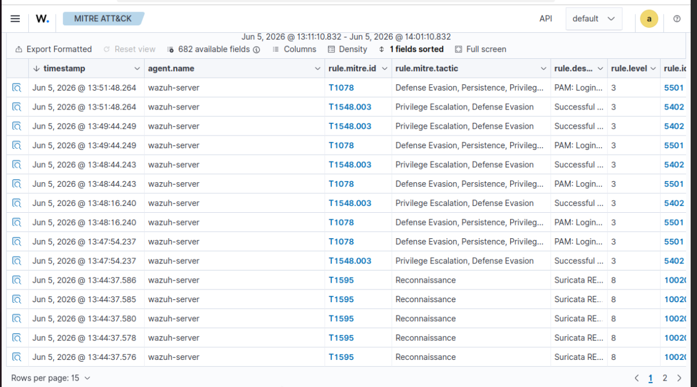

# Scenario 01 — Network reconnaissance with Nmap

> **First contact.** Before exploiting anything, an attacker maps what's there. This scenario shows that an `nmap -sV` scan from Kali is detected **eight times** in the SIEM — four times by each of the two Suricata instances we run on pfSense — within milliseconds of the first probe.

## TL;DR

| | |
|---|---|
| **MITRE technique** | [T1595 — Active Scanning](https://attack.mitre.org/techniques/T1595/) |
| **MITRE tactic** | TA0043 — Reconnaissance |
| **Attacker** | Kali — `10.10.10.51` (VLAN 10) |
| **Target** | Ubuntu-DMZ — `10.10.30.50` (VLAN 30) |
| **Attack tool** | `nmap -sV -p 22,80,3306` |
| **Detection layer** | NIDS only — Suricata × 2 instances on pfSense |
| **Wazuh rule chain** | decoder `pfsense-suricata` → rule `100200` (catch-all, level 5) → rule `100201` (recon, **level 8, T1595**) |
| **Alerts captured** | **8** per scan (4 from LAN sensor `vtnet1` + 4 from DMZ sensor `vtnet3`) |
| **Suricata signature** | `2024364 — ET SCAN Possible Nmap User-Agent Observed` (rev 5) |
| **Detection latency** | < 1 s (first alert at `T+1.4 s` of the scan window) |
| **Scan duration** | 6.97 s (`nmap` self-report) |

## 1. Threat model

### 1.1 Attacker profile

An external-or-internal actor who has reached the attack subnet (VLAN 10). In a real network this would be a compromised workstation or an attacker already pivoted past the perimeter. They have IP-level reachability to the DMZ but no credentials, no shell, no prior knowledge of the services exposed.

### 1.2 Attacker objective

Build a **target map**: which IPs are alive, which TCP ports are open, which software versions answer. Everything downstream — exploit selection, brute-force target choice, lateral movement planning — depends on the quality of this map.

### 1.3 Why detect this

Reconnaissance is the only attack phase that happens **before** damage is done. A well-tuned NIDS catches scans cheaply (no host instrumentation needed) and gives the SOC a chance to **block the source IP** before the attacker reaches exploitation. Missing a scan means losing the earliest detection opportunity in the whole intrusion chain.

### 1.4 Pre-conditions in our lab

- pfSense routing VLAN 10 → VLAN 30 (firewall pass rule on LAN, see [`01-pfsense-firewall.md`](../03-installation/01-pfsense-firewall.md))
- Suricata running on **both** the LAN interface (`vtnet1`, attacker side) and the OPT2 interface (`vtnet3`, DMZ side) — see [`07-suricata-pfsense.md`](../03-installation/07-suricata-pfsense.md)
- ETOpen ruleset loaded, including `emerging-scan.rules`
- Wazuh manager listening on UDP/514 for pfSense syslog
- Custom decoder `pfsense-suricata-extract` and rules `100200`/`100201` deployed — see [`configs/wazuh/local_rules.xml`](../../configs/wazuh/local_rules.xml)

## 2. Attack execution

### 2.1 Setup

From Kali (`10.10.10.51`):

```bash
# Sanity — confirm target reachability before scanning
ping -c 2 10.10.30.50
```

### 2.2 Baseline scan executed

```bash
$ date
Fri Jun  5 01:44:12 PM CEST 2026

$ sudo nmap -sV -p 22,80,3306 10.10.30.50
Starting Nmap 7.98 ( https://nmap.org ) at 2026-06-05 13:44 +0200
Nmap scan report for 10.10.30.50
Host is up (0.0014s latency).

PORT     STATE  SERVICE VERSION
22/tcp   open   ssh     OpenSSH 9.2p1 Debian 2+deb12u3 (protocol 2.0)
80/tcp   open   http    Apache httpd 2.4.25 ((Debian))
3306/tcp closed mysql
Service Info: OS: Linux; CPE: cpe:/o:linux:linux_kernel

Service detection performed. Please report any incorrect results at https://nmap.org/submit/ .
Nmap done: 1 IP address (1 host up) scanned in 6.97 seconds

$ date
Fri Jun  5 01:44:41 PM CEST 2026
```



### 2.3 What the attacker now knows

- **Port 22 / ssh** — `OpenSSH 9.2p1 Debian 2+deb12u3`. This is the **Cowrie honeypot** answering, configured to mimic a current Debian 12 banner — a deliberate trap. A naive attacker will read this as "modern, patched server" and may target it with current-OpenSSH exploits that will all fail safely inside Cowrie.
- **Port 80 / http** — `Apache httpd 2.4.25`, the DVWA front-end.
- **Port 3306 / mysql** — `closed`. DVWA's MariaDB runs on an internal Docker network and is not exposed.

The signal-to-noise of the result is realistic: 2/3 ports are exploitable in some way, exactly what an attacker hopes for.

## 3. Detection mechanism

### 3.1 Suricata signature that fires

The 8 alerts all match the same ETOpen signature:

```
SID:        2024364 (rev 5)
Name:       ET SCAN Possible Nmap User-Agent Observed
Category:   Web Application Attack
Severity:   1
Class:      emerging-scan.rules
```

**Important nuance:** this signature is matched at the **HTTP application layer**, not the TCP layer — it fingerprints the `User-Agent: Mozilla/5.0 (compatible; Nmap Scripting Engine; ...)` string that `-sV` sends when probing port 80. That's why every one of the 8 alerts carries `dest_port: 80` even though the scan also touched ports 22 and 3306. The SSH and MySQL probes did not trigger this particular signature.

> A more aggressive scan (`nmap -sS -A -p-`) would additionally trigger `2009582 — ET SCAN NMAP -sS window 1024` and other TCP-flag signatures.

### 3.2 Wazuh rule chain

```
pfSense syslog (UDP/514, src 10.10.40.1)
    ↓
decoder "pfsense-suricata"          ← prematch on "event_type":"alert"
    ↓
decoder "pfsense-suricata-extract"  ← PCRE2 regex extracts src_ip + signature
    ↓
rule 100200 (level 5)               ← catch-all on every Suricata alert
    ↓
rule 100201 (level 8)               ← signature matches SCAN|Nmap|scan|nmap
    ↓
mitre.id = T1595 / Reconnaissance / Active Scanning
```

Level `8` is deliberate: high enough to surface in default Threat-Hunting views (level ≥ 3), low enough to be clearly distinguishable from a successful intrusion (Cowrie `login.success` is level 10; Suricata web-attack `100202` is level 10).

### 3.3 Why two Suricata instances

Both instances see the same TCP traffic but from different perspectives:

- **LAN_Suricata (`vtnet1`, pid 79414)** — sees the scan *leaving* the attacker.
- **DMZ_Suricata (`vtnet3`, pid 78119)** — sees the scan *arriving* at the target.

This means every detection is corroborated by an independent sensor with no shared failure mode: separate Suricata process, separate NIC, separate ETOpen state. If LAN_Suricata were disabled, killed, or compromised, DMZ_Suricata would still catch the scan. That's defense in depth in the strict NIST sense (SP 800-53 SI-4), not just an architecture slogan.

## 4. Evidence collected

### 4.1 Quick counts

```bash
$ sudo grep -c 'Rule: 100201' /var/ossec/logs/alerts/alerts.log
16
```

16 lifetime hits in `alerts.log` — 8 from the validation scan run the previous night, plus the **8** from the `13:44` scan documented here.

### 4.2 Vantage point split (the defense-in-depth proof)

From the 8 alerts of the `13:44` scan, broken down by Suricata pid (each pid is one instance):

| Suricata pid | Interface | Vantage point | Alerts |
|---|---|---|---|
| `79414` | `vtnet1` | LAN — attacker-side | **4** |
| `78119` | `vtnet3` | DMZ — destination-side | **4** |
| | | **Total** | **8** |

Sample raw events from `/var/ossec/logs/alerts/alerts.log` showing the same `src_ip` / `dest_ip` / `signature_id` captured by both instances within milliseconds:

**LAN sensor (`vtnet1`):**
```
** Alert 1780659877.114083: - suricata,ids,nids,recon,scan,attack,
2026 Jun 05 11:44:37 wazuh-server->10.10.40.1
Rule: 100201 (level 8) -> 'Suricata RECON: ET SCAN Possible Nmap User-Agent Observed from 10.10.10.51'
Jun  5 13:44:38 suricata[79414]: {"timestamp":"2026-06-05T13:44:38.420099+0200","flow_id":1795089151435367,
"in_iface":"vtnet1","event_type":"alert","src_ip":"10.10.10.51","src_port":53404,
"dest_ip":"10.10.30.50","dest_port":80,"proto":"TCP",
"alert":{"signature_id":2024364,"rev":5,"signature":"ET SCAN Possible Nmap User-Agent Observed",...},
"app_proto":"http","direction":"to_server"}
```

**DMZ sensor (`vtnet3`), 6 ms later:**
```
** Alert 1780659877.115643: - suricata,ids,nids,recon,scan,attack,
2026 Jun 05 11:44:37 wazuh-server->10.10.40.1
Rule: 100201 (level 8) -> 'Suricata RECON: ET SCAN Possible Nmap User-Agent Observed from 10.10.10.51'
Jun  5 13:44:38 suricata[78119]: {"timestamp":"2026-06-05T13:44:38.420101+0200","flow_id":1795205709963515,
"in_iface":"vtnet3","event_type":"alert","src_ip":"10.10.10.51","src_port":53404,
"dest_ip":"10.10.30.50","dest_port":80,"proto":"TCP",
"alert":{"signature_id":2024364,"rev":5,"signature":"ET SCAN Possible Nmap User-Agent Observed",...},
"app_proto":"http","direction":"to_server"}
```

Identical `flow_id`-class context (different IDs because each Suricata maintains its own flow table), identical TCP 5-tuple, identical signature — but captured by two independent sensors.

### 4.3 Structured query (alerts.json)

```bash
sudo tail -300 /var/ossec/logs/alerts/alerts.json | \
  jq -r 'select(.rule.id == "100201") | "\(.timestamp) | \(.data.signature) | \(.data.src_ip)"' | tail -10
```

```
2026-06-05T11:44:37.569+0000 | ET SCAN Possible Nmap User-Agent Observed | 10.10.10.51
2026-06-05T11:44:37.571+0000 | ET SCAN Possible Nmap User-Agent Observed | 10.10.10.51
2026-06-05T11:44:37.575+0000 | ET SCAN Possible Nmap User-Agent Observed | 10.10.10.51
2026-06-05T11:44:37.576+0000 | ET SCAN Possible Nmap User-Agent Observed | 10.10.10.51
2026-06-05T11:44:37.578+0000 | ET SCAN Possible Nmap User-Agent Observed | 10.10.10.51
2026-06-05T11:44:37.580+0000 | ET SCAN Possible Nmap User-Agent Observed | 10.10.10.51
2026-06-05T11:44:37.585+0000 | ET SCAN Possible Nmap User-Agent Observed | 10.10.10.51
2026-06-05T11:44:37.586+0000 | ET SCAN Possible Nmap User-Agent Observed | 10.10.10.51
```

All 8 alerts cluster within a **17 ms window** at the manager — far below the typical analyst review interval.

### 4.4 Wazuh dashboard — Threat Hunting

Filter `rule.id: 100201 and data.src_ip: "10.10.10.51"`, last 15 minutes:



The histogram bucket at 13:44 contains all 8 hits; the rest of the timeline is empty. Visible inline in the `_source` columns: `rule.id: 100201`, `rule.mitre.id: T1595`, `rule.mitre.tactic: Reconnaissance`, `data.src_ip: 10.10.10.51`.

### 4.5 Per-alert detail — the two vantage points

**LAN sensor (`predecoder.hostname: suricata[79414]`, `in_iface: vtnet1`):**



**DMZ sensor (`predecoder.hostname: suricata[78119]`, `in_iface: vtnet3`):**



Side by side, the two screenshots show the same TCP 5-tuple (`10.10.10.51:53404 → 10.10.30.50:80`) and the same `signature_id 2024364`, captured by two independent Suricata processes (pid 79414 vs 78119) on two distinct interfaces. This is the defense-in-depth claim, proven by logs and not narrated.

### 4.6 MITRE ATT&CK view



The Reconnaissance column is lit on **T1595** with 5 visible hits at `13:44:37` (the remaining 3 are on page 2 — pagination visible at the bottom). The unrelated `T1078` and `T1548.003` entries at later timestamps come from `anass` running `sudo` on the manager and are not part of this scenario.

## 5. Analysis

### 5.1 Defense in depth, by the numbers

- **2 sensors**, **2 distinct pids** (79414, 78119), **2 distinct network interfaces** (vtnet1, vtnet3) — no shared dependency.
- **4 alerts each**, perfectly balanced — neither sensor missed any of the four HTTP probes.
- **6 ms** is the worst-case timestamp delta between the two sensors for the same packet — both effectively see the scan in real time.

If LAN_Suricata had failed silently between yesterday's validation and today's scan, DMZ_Suricata would still have produced 4 alerts — the SOC would still have caught the recon. **One sensor failure is not a detection failure.**

### 5.2 Detection latency

| Step | Time |
|---|---|
| `nmap` first packet | T₀ = `13:44:37.???` (sub-second precision lost in `date` output) |
| Suricata logs to `eve.json` (LAN) | T₀ + ~ms |
| pfSense syslog forwards UDP/514 | T₀ + ~ms |
| Wazuh decoder + rule match → `alerts.log` | `13:44:37.569` (first), `.586` (last) |
| `nmap` finished (Kali clock) | `13:44:41` |

End-to-end: alerts are in the SIEM **3+ seconds before the scan even finishes**.

### 5.3 Limitations

- **No automatic blocking.** Suricata runs in IDS mode, not IPS. The attacker keeps scanning until manually blocked at the firewall. A Wazuh active-response action could automate this — listed as future work in [`README.md`](../../README.md).
- **Application-layer dependent for this signature.** The `ET SCAN Possible Nmap User-Agent Observed` rule only fires on HTTP probes. A scanner that customizes its User-Agent (`nmap --script-args http.useragent=...`) would evade it. Other ETOpen rules catch the TCP-options fingerprint, but the current ruleset is not exhaustive.
- **No host-side recon detection.** An attacker doing TCP-connect scans from inside the DMZ would not be caught by these signatures (no NIDS east-west). The Wazuh HIDS would partially compensate via `auth.log` if SSH probes hit real services.

### 5.4 What would defeat this detection (and how we would counter)

| Evasion | Why it works against current rules | Counter (future) |
|---|---|---|
| Custom User-Agent in `-sV` probes | The exact UA string no longer matches signature 2024364 | Add a Suricata rule on Nmap's TCP options fingerprint |
| Slow scan, `--max-rate 1` over hours | Signatures still match per-probe, but volume can drop below alerting thresholds | Add Wazuh correlation rule "≥ 5 ET SCAN hits from same src in 24h" |
| Decoy scan, `nmap -D RND:10` | Real source IP buried among 10 spoofed ones | Cross-correlate with pfSense state table to identify the true initiator |
| Idle / zombie scan, `-sI` | No direct packet from attacker IP | Flow-based detection (Zeek + anomaly model) — V2 scope |

---

← [`README.md`](./README.md) | **Next:** [`02-ssh-bruteforce-deception.md →`](./02-ssh-bruteforce-deception.md)
