# Scenario 02 — SSH brute force: real sshd vs Cowrie deception

> **The same attack, on two different ports — two completely different detection stories.** This scenario contrasts a brute-force attack against the real vulnerable `sshd` on port 2200 (caught by Wazuh's built-in OSSEC rules via `journald`) with the same attack against the Cowrie honeypot on port 22 (caught by our custom rules `100100`–`100105`). The comparison surfaces one of the strongest claims of the architecture: **deception logs contain information the real `sshd` never will — including the password in clear text — and they have zero false positives by construction.**

## TL;DR

| | |
|---|---|
| **MITRE kill chain** | T1110 → T1110.001 → T1078 → T1059 |
| **Attacker** | Kali — `10.10.10.51` (VLAN 10) |
| **Target** | Ubuntu-DMZ — `10.10.30.50` (VLAN 30) |
| **Attack tools** | `hydra v9.7`  + `sshpass` |
| **Targets** | Port `2200` (real sshd) + port `22` (Cowrie honeypot) |
| **Detection layers** | HIDS only — Wazuh agent on the DMZ |
| **Detection sources** | `journald` (real sshd) + `cowrie.json` (honeypot) |
| **Total alerts** | **71** for 31 SSH connections — 16 for sshd, 55 for Cowrie |
| **Critical alerts (level ≥ 10)** | sshd: `5763` (T1110) + Cowrie: `100103` (T1078) + Cowrie: `100105` (T1110.001) + Cowrie: `100104` (T1059) |
| **Headline finding** | Cowrie captures **the attacker's exact password and exact shell commands**; the real sshd never does. |

## 1. Threat model

### 1.1 Attacker profile

The same actor as scenario 01 — they have reached VLAN 10, mapped the DMZ via Nmap (see [`01-nmap-recon.md`](./01-nmap-recon.md)), and now hold a target list: `22/tcp` (banner: OpenSSH 9.2p1 Debian — actually Cowrie), `2200/tcp` (real sshd), `80/tcp` (DVWA). The natural next step is credential access.

### 1.2 Attacker objective

Obtain a valid `(user, password)` pair to log into the DMZ host. The attacker is opportunistic: any service that accepts password authentication is a candidate. They will hit **port 2200** because nmap fingerprinted it as a real OpenSSH, and **port 22** because the banner looks identical.

### 1.3 Why detect this

Brute force is the most common credential-access tactic in the wild. It's noisy by nature, which makes detection feasible — but most SOCs are buried in false positives from legitimate users mistyping passwords. The honeypot pipeline solves this: nobody legitimate ever connects to port 22, so **every event on that port is, by construction, malicious.**

### 1.4 Pre-conditions in our lab

- DMZ host listening on **`22`** (Cowrie container), **`2200`** (real sshd, deliberately weak: `admin/admin123`), **`2222`** (hardened sshd, key-only)
- Wazuh agent on the DMZ tailing `journald` (built-in) **and** `/home/socadmin/cowrie/var/log/cowrie/cowrie.json` (custom `<localfile>`) — see [`06-wazuh-agent-dmz.md`](../03-installation/06-wazuh-agent-dmz.md)
- Custom Cowrie rules `100100`–`100105` deployed at [`configs/wazuh/local_rules.xml`](../../configs/wazuh/local_rules.xml)
- Cowrie `userdb.txt` configured to **reject** `root/root` and `root/toor`, **accept** any password for `admin / oracle / ubuntu / pi` — see [`configs/cowrie/userdb.txt`](../../configs/cowrie/userdb.txt)

## 2. Attack execution

### 2.1 Wordlist

A 15-password dictionary representative of what an opportunistic attacker would try first, with the legitimate target password (`admin123`) deliberately included:

```bash
cat > /tmp/wordlist.txt << 'EOF'
root
toor
123
1234
12345
123456
123456789
admin
password
passw0rd
test
ubuntu
P@ssword
admin123
test123
EOF
```

### 2.2 Attack A — brute force on port 2200 (real sshd)

```bash
$ date
Fri Jun  5 09:22:22 PM CEST 2026

$ sudo hydra -l admin -P /tmp/wordlist.txt -t 4 -f ssh://10.10.30.50:2200
Hydra v9.7 (c) 2023 by van Hauser/THC & David Maciejak

Hydra (https://github.com/vanhauser-thc/thc-hydra) starting at 2026-06-05 21:22:48
[DATA] max 4 tasks per 1 server, overall 4 tasks, 15 login tries (l:1/p:15), ~4 tries per task
[DATA] attacking ssh://10.10.30.50:2200/
[2200][ssh] host: 10.10.30.50   login: admin   password: admin123
1 of 1 target successfully completed, 1 valid password found
Hydra (https://github.com/vanhauser-thc/thc-hydra) finished at 2026-06-05 21:23:07

$ date
Fri Jun  5 09:23:16 PM CEST 2026
```

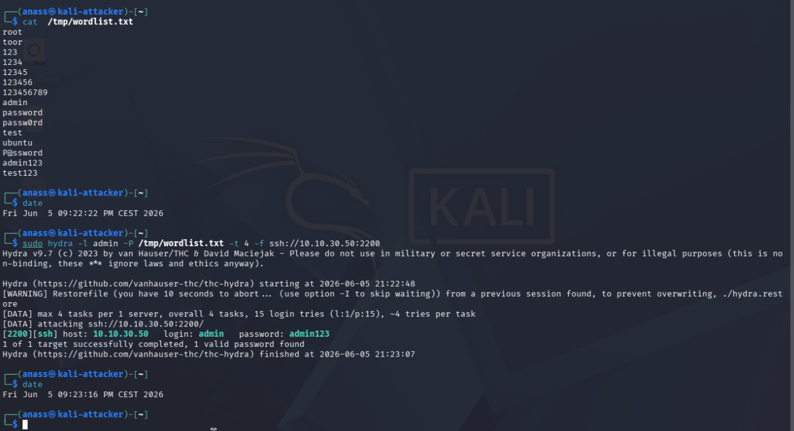

`admin/admin123` is cracked in **19 seconds** of Hydra runtime. Note that Hydra opens 4 parallel sockets — so all 15 attempts are sent within a 6-second burst.

### 2.3 Attack B.1 — brute force on port 22 (Cowrie, unknown user)

```bash
$ date
Sat Jun  6 01:50:05 AM CEST 2026

$ sudo hydra -l administrator -P /tmp/wordlist.txt -t 4 ssh://10.10.30.50:22
Hydra (https://github.com/vanhauser-thc/thc-hydra) starting at 2026-06-06 01:50:12
[DATA] max 4 tasks per 1 server, overall 4 tasks, 15 login tries (l:1/p:15), ~4 tries per task
[DATA] attacking ssh://10.10.30.50:22/
1 of 1 target completed, 0 valid password found
Hydra (https://github.com/vanhauser-thc/thc-hydra) finished at 2026-06-06 01:50:17

$ date
Sat Jun  6 01:50:21 AM CEST 2026
```

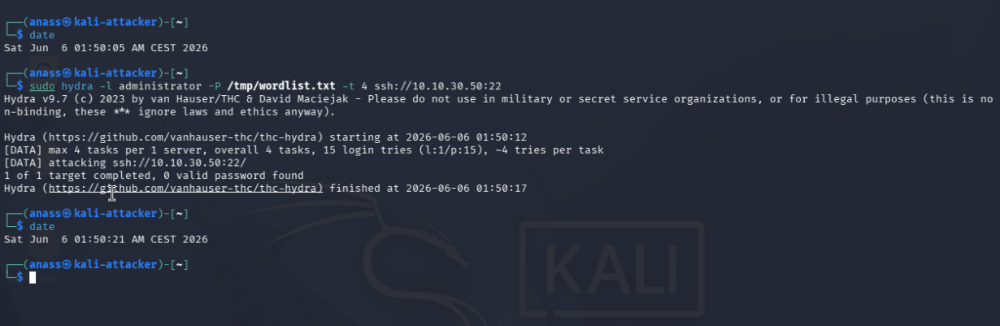

The username `administrator` is **not** in Cowrie's `userdb.txt`, so every attempt fails — exactly what we want to isolate the failure rules `100102` and the brute-force correlation rule `100105`. Runtime: **5 seconds** flat.

> Note: no `-f` flag here, on purpose. We want all 15 attempts to complete so the correlation window of rule `100105` (5 failures in 120 s) triggers cleanly.

### 2.4 Attack B.2 — successful login on port 22 (Cowrie, accepted user)

Cowrie's `userdb.txt` line `admin:x:*` means **any password works for `admin`**. We pick an absurd password to make the point:

```bash
$ date
Sat Jun  6 02:15:07 AM CEST 2026

$ sshpass -p 'WhateverPassword2026!' ssh -o StrictHostKeyChecking=no \
    -o UserKnownHostsFile=/dev/null -p 22 admin@10.10.30.50 \
    'whoami; id; ls -la /; cat /etc/passwd | head -3; exit'

Warning: Permanently added '10.10.30.50' (ED25519) to the list of known hosts.
admin
uid=9673(admin) gid=9673(admin) groups=9673(admin)
drwxr-xr-x 1 root root    0 2024-06-12 00:00 .
drwxr-xr-x 1 root root    0 2024-06-12 00:00 ..
-rwxr-xr-x 1 root root    0 2026-05-04 14:44 .dockerenv
lrwxrwxrwx 1 root root    7 2024-06-12 00:00 bin -> usr/bin
drwxr-xr-x 1 root root 4096 2024-01-28 21:20 boot
drwxr-xr-x 1 root root  340 2026-05-04 14:44 dev
drwxr-xr-x 1 root root 4096 2026-05-04 14:46 etc
[...]
root:x:0:0:root:/root:/bin/bash
daemon:x:1:1:daemon:/usr/sbin:/usr/sbin/nologin
bin:x:2:2:bin:/bin:/bin/sbin/nologin

$ date
Sat Jun  6 02:15:33 AM CEST 2026
```

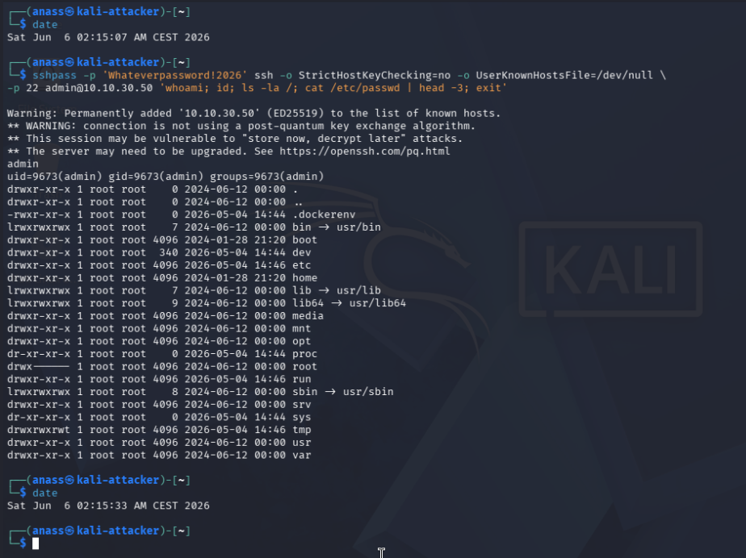

Cowrie returns a **convincing fake shell**:

- `whoami` → `admin` (matches the login name — Cowrie maintains consistency)
- `id` → `uid=9673(admin)` (the suspicious uid 9673 is the only hint that something is off — most attackers won't notice)
- `ls -la /` → a complete fake filesystem with plausible timestamps and permissions
- `cat /etc/passwd` → a fake `passwd` file with standard system accounts

The attacker leaves believing they have a foothold. In reality every keystroke is logged, every command is recorded, and the SOC has a credential they can now use as a canary across the rest of the network.

This command was run **twice** during validation, so the dataset below shows 2 sessions.

## 3. Detection mechanism

### 3.1 Two parallel detection pipelines

| Pipeline | Source | Decoder | Rules |
|---|---|---|---|
| **HIDS on real sshd** | `journald` (Ubuntu 24.04 systemd default — no more `/var/log/auth.log` as primary) | OSSEC built-in `sshd` decoder | OSSEC built-in: `5760`, `5763`, `5503`, `2502`, `5758` |
| **HIDS on Cowrie** | `/home/socadmin/cowrie/var/log/cowrie/cowrie.json` | OSSEC built-in `json` decoder | Custom: `100100`–`100105` |

Both pipelines run on the **same Wazuh agent** on the DMZ, both ship to the **same manager**, both surface in the **same dashboard** with a single query language — that's the "single pane of glass" claim in concrete form.

> **Note on Ubuntu 24.04:** systemd reroutes most authentication events through `journald`. The Wazuh agent already includes a `<localfile>` of type `journald` in the default config, so no additional setup is needed. Reading `/var/log/auth.log` would also work (the file still exists, populated by `rsyslog`), but `journald` is the canonical source.

### 3.2 Built-in OSSEC rules that fired (port 2200)

These rules ship with the Wazuh manager — we wrote nothing for them:

| Rule | Level | Description | MITRE | Why it fired |
|---|---|---|---|---|
| `5760` | 5 | `sshd: authentication failed` | — | 1 per failed password — fired **9 times** |
| `5503` | 5 | `PAM: User login failed` | — | PAM also logs the failure — fired **4 times** |
| `2502` | 10 | `syslog: User missed the password more than one time` | — | Correlation, fired **2 times** |
| **`5763`** | **10** | **`sshd: brute force trying to get access to the system`** | **T1110** Brute Force | **The headline alert** — fired **1 time** |

A noteworthy non-finding: rule `5710` ("attempt to login using a non-existent user") fired **0 times**, because `admin` *exists* on the DMZ. The rule chain depends on whether the username is valid — useful to know when tuning detections.

### 3.3 Custom Cowrie rules (port 22)

Full content of [`configs/wazuh/local_rules.xml`](../../configs/wazuh/local_rules.xml) for the Cowrie group:

```xml
<group name="cowrie,honeypot,">

  <rule id="100100" level="3">
    <decoded_as>json</decoded_as>
    <field name="eventid">^cowrie\.</field>
    <description>Cowrie honeypot: $(eventid) from $(src_ip)</description>
    <group>cowrie_event,</group>
  </rule>

  <rule id="100101" level="6">
    <if_sid>100100</if_sid>
    <field name="eventid">^cowrie\.session\.connect$</field>
    <description>HONEYPOT: New SSH connection from $(src_ip) to Cowrie</description>
    <mitre><id>T1110</id></mitre>
    <group>cowrie_connect,attack,</group>
  </rule>

  <rule id="100102" level="8">
    <if_sid>100100</if_sid>
    <field name="eventid">^cowrie\.login\.failed$</field>
    <description>HONEYPOT: Failed login from $(src_ip) - user=$(username) password=$(password)</description>
    <mitre><id>T1110.001</id></mitre>
    <group>cowrie_login_failed,authentication_failures,</group>
  </rule>

  <rule id="100103" level="10">
    <if_sid>100100</if_sid>
    <field name="eventid">^cowrie\.login\.success$</field>
    <description>HONEYPOT CRITICAL: Successful login from $(src_ip) - user=$(username) password=$(password) - ATTACKER ENGAGED</description>
    <mitre><id>T1078</id></mitre>
    <group>cowrie_login_success,attack,</group>
  </rule>

  <rule id="100104" level="9">
    <if_sid>100100</if_sid>
    <field name="eventid">^cowrie\.command\.input$</field>
    <description>HONEYPOT: Attacker executed command "$(input)" from $(src_ip)</description>
    <mitre><id>T1059</id></mitre>
    <group>cowrie_command,attack,</group>
  </rule>

  <rule id="100105" level="12" frequency="5" timeframe="120">
    <if_matched_sid>100102</if_matched_sid>
    <same_field>src_ip</same_field>
    <description>HONEYPOT: SSH brute force from $(src_ip) - 5+ failed attempts in 2 min</description>
    <mitre><id>T1110.001</id></mitre>
    <group>cowrie_bruteforce,attack,</group>
  </rule>

</group>
```

Design choices worth noting:

- **`100100` is a non-alerting catch-all** (level 3) that matches every `cowrie.*` event via `<decoded_as>json</decoded_as>` + `<field name="eventid">^cowrie\.</field>`. It's never actioned by itself; its purpose is to give the child rules a parent SID to chain against (`<if_sid>100100</if_sid>`).
- **`100103` injects the literal string `ATTACKER ENGAGED`** in its description so the alert is unmistakable even at a glance — written for the human analyst, not just for the indexer.
- **`100105` correlates** with `<frequency>5</frequency><timeframe>120</timeframe><same_field>src_ip</same_field>`: 5 failed logins from the same source IP within 2 minutes raises a level 12. This is the rule with the highest level in the entire ruleset.
- **MITRE mapping is granular**: `100102` and `100105` use **T1110.001** (Password Guessing), not the generic T1110, because both rules specifically detect dictionary-based login attempts.

### 3.4 The MITRE kill chain observed

Across both attacks, Wazuh produced events covering four distinct MITRE techniques in the expected sequence:

```
TA0043 Reconnaissance       — T1595         (covered by scenario 01)
TA0006 Credential Access    — T1110         — sshd 5763 + Cowrie 100101
TA0006 Credential Access    — T1110.001     — Cowrie 100102 + 100105
TA0001 Initial Access       — T1078         — Cowrie 100103
TA0002 Execution            — T1059         — Cowrie 100104
```

Five MITRE techniques, four detection rules, one SIEM. **The kill chain is observable end-to-end without any external correlation tool.**

## 4. Evidence collected

### 4.1 Lifetime counts

Cumulative hits across all validation runs:

```bash
$ for rid in 5760 5763 5503 2502 100100 100101 100102 100103 100104 100105; do
    cnt=$(sudo grep -c "\"id\":\"$rid\"" /var/ossec/logs/alerts/alerts.json)
    echo "rule $rid : $cnt hit(s)"
  done

rule 5760  : 248 hit(s)
rule 5763  :   4 hit(s)
rule 5503  :  42 hit(s)
rule 2502  :   *  (counted via filter, ~34 firedtimes observed)
rule 100100: 32 hit(s)
rule 100101: 12 hit(s)
rule 100102: 25 hit(s)
rule 100103:  2 hit(s)
rule 100104:  2 hit(s)
rule 100105:  5 hit(s)
```

### 4.2 Attack A evidence (port 2200, real sshd)

Filter `data.srcip: "10.10.10.51" and rule.id: (5760 or 5763 or 5503 or 2502)`, **16 hits in a 30-second burst**:

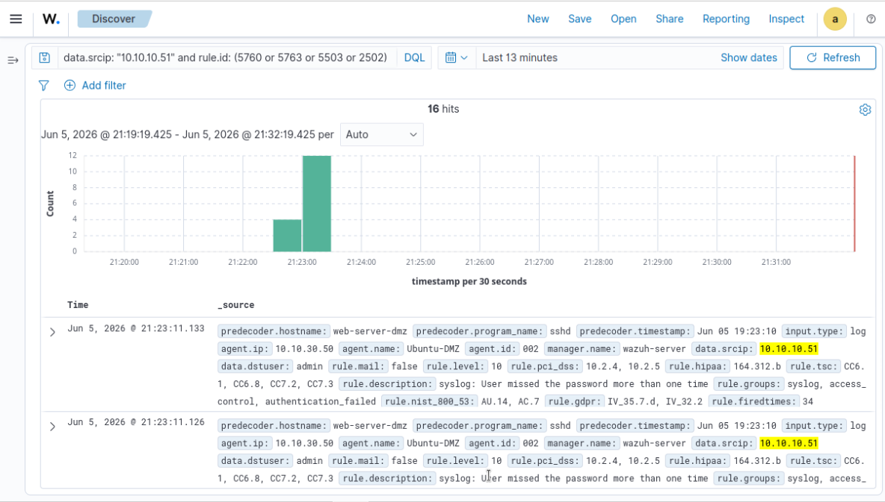

Drill-down on the headline alert (`rule.id: 5763`, level 10):

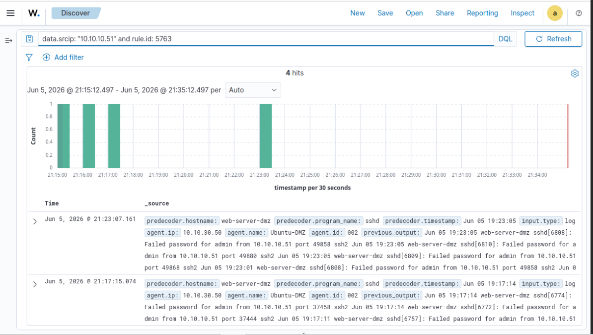

Key fields visible in the screenshot:

```
rule.description     : sshd: brute force trying to get access to the system. Authentication failed.
rule.firedtimes      : 31
rule.frequency       : 8
rule.level           : 10
rule.id              : 5763
rule.mitre.id        : T1110
rule.mitre.tactic    : Credential Access
rule.mitre.technique : Brute Force
previous_output      : (8 consecutive "Failed password for admin from 10.10.10.51" lines)
```

The MITRE mapping is **native** — OSSEC's built-in `sshd` ruleset already includes the `<mitre>` tag. We did not edit anything.

Histogram of rule `5763` lifetime hits — the isolated bucket at `21:23` is our attack:

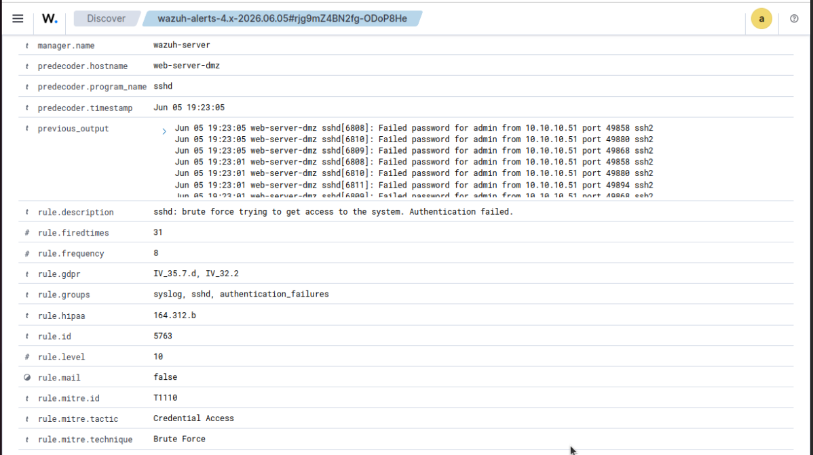

Raw extract from `/var/ossec/logs/alerts/alerts.log`:

```
** Alert 1780687387.389787: - syslog,sshd,authentication_failures,...
2026 Jun 05 19:23:07 (Ubuntu-DMZ) any->journald
Rule: 5763 (level 10) -> 'sshd: brute force trying to get access to the system. Authentication failed.'
Src IP: 10.10.10.51
Src Port: 49894
User: admin
Jun 05 19:23:05 web-server-dmz sshd[6811]: Failed password for admin from 10.10.10.51 port 49894 ssh2
Jun 05 19:23:05 web-server-dmz sshd[6808]: Failed password for admin from 10.10.10.51 port 49858 ssh2
Jun 05 19:23:05 web-server-dmz sshd[6810]: Failed password for admin from 10.10.10.51 port 49880 ssh2
Jun 05 19:23:05 web-server-dmz sshd[6809]: Failed password for admin from 10.10.10.51 port 49868 ssh2
Jun 05 19:23:01 web-server-dmz sshd[6808]: Failed password for admin from 10.10.10.51 port 49858 ssh2
```

> The username is logged (`admin`). The password is **never logged** — OpenSSH deliberately strips it from every log line for security. This is a baseline limitation we will overcome in the next pipeline.

### 4.3 Attack B.1 evidence (port 22, Cowrie brute force)

Filter `data.src_ip: "10.10.10.51" and rule.id: (100100 or 100101 or 100102 or 100105)`, **35 hits in a 5-second burst**:

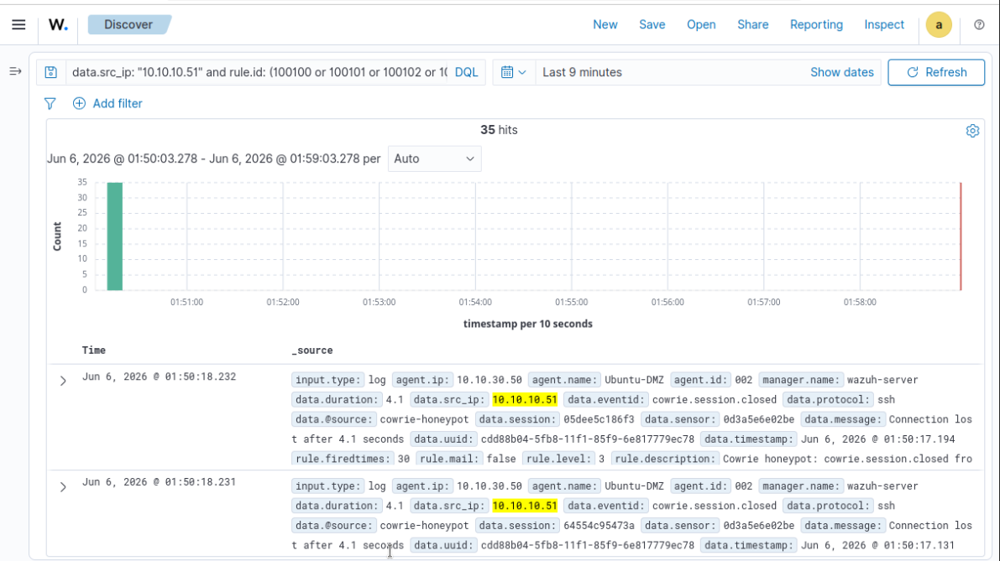

The headline alert — rule `100105`, level **12**, the highest in the entire ruleset:

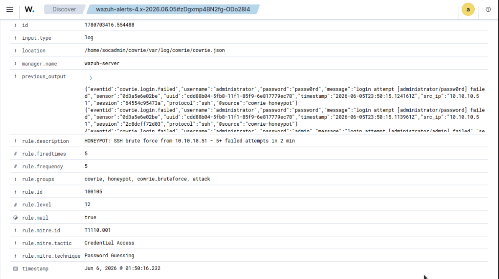

```
rule.description     : HONEYPOT: SSH brute force from 10.10.10.51 - 5+ failed attempts in 2 min
rule.firedtimes      : 5
rule.frequency       : 5
rule.level           : 12
rule.id              : 100105
rule.mail            : true                                        ← only this rule pages the SOC
rule.mitre.id        : T1110.001
rule.mitre.tactic    : Credential Access
rule.mitre.technique : Password Guessing                          ← more specific than 5763's T1110
```

And the rule that **leaks the attacker's exact password** — `100102` on the attempt `[administrator/test123]`:

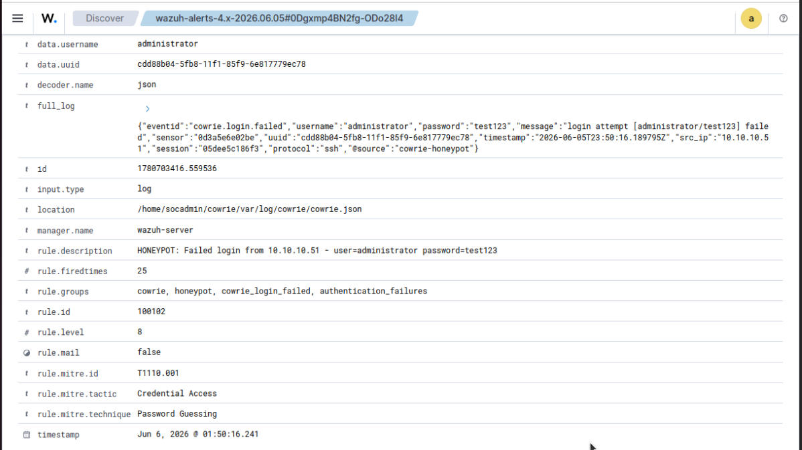

```
rule.description : HONEYPOT: Failed login from 10.10.10.51 - user=administrator password=test123
data.username    : administrator
data.password    : test123                                         ← this is what sshd never shows
rule.mitre.id    : T1110.001
```

This is the most operationally valuable data point of the entire pipeline: **we know exactly what wordlist the attacker is using**. With sshd alone, we know only that `admin` is under attack — we have no insight into the attacker's tooling or strategy. With Cowrie, we have their complete dictionary, in real time, as they exhaust it.

### 4.4 Attack B.2 evidence (port 22, Cowrie successful login + commands)

Filter `data.src_ip: "10.10.10.51" and rule.id: (100103 or 100104)`, **4 hits across 2 sessions**:

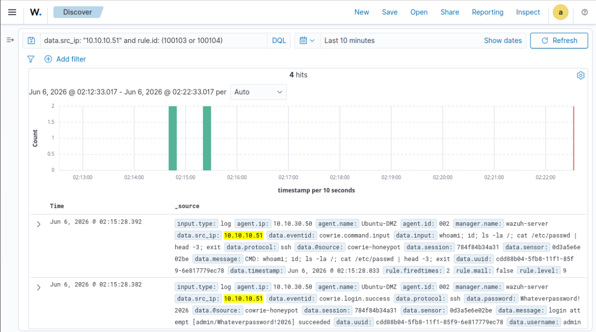

Visible in the `_source` column of the screenshot:

```
data.eventid  : cowrie.login.success
data.password : Whateverpassword!2026                              ← password in clear text
data.username : admin
data.input    : whoami; id; ls -la /; cat /etc/passwd | head -3; exit
data.@source  : cowrie-honeypot
```

The **headline alert** of the entire scenario — `100103`, level 10, `ATTACKER ENGAGED` literally in the description:

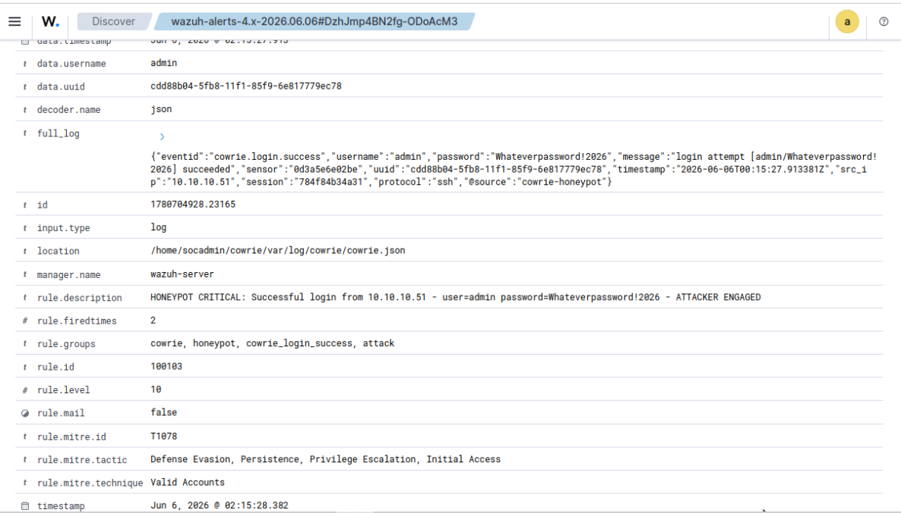

```
rule.description     : HONEYPOT CRITICAL: Successful login from 10.10.10.51
                       - user=admin password=Whateverpassword!2026 - ATTACKER ENGAGED
rule.level           : 10
rule.id              : 100103
rule.mitre.id        : T1078
rule.mitre.tactic    : Defense Evasion, Persistence, Privilege Escalation, Initial Access
rule.mitre.technique : Valid Accounts
```

The MITRE mapping moves from T1110 (Brute Force) to **T1078 (Valid Accounts)** — the attacker is no longer trying passwords, they have a foothold. Same MITRE framework, different tactic, automatically reflected in the dashboard. The pivot in the kill chain is *visible*.

And the command-capture rule `100104`:

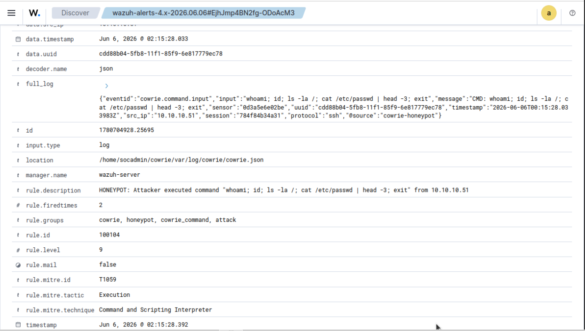

```
rule.description     : HONEYPOT: Attacker executed command
                       "whoami; id; ls -la /; cat /etc/passwd | head -3; exit" from 10.10.10.51
rule.level           : 9
rule.id              : 100104
rule.mitre.id        : T1059
rule.mitre.tactic    : Execution
rule.mitre.technique : Command and Scripting Interpreter
data.input           : whoami; id; ls -la /; cat /etc/passwd | head -3; exit
data.eventid         : cowrie.command.input
```

This is **threat intelligence in real time**. We not only know the attacker compromised an account; we know their post-exploitation TTP — and we can pivot on patterns like `cat /etc/passwd` to flag this technique across other endpoints, fed by a Wazuh active response.

## 5. Analysis

### 5.1 What deception captures that the real sshd cannot

| Data point | Real sshd (rule 5763) | Cowrie (rules 100102 / 100103) |
|---|---|---|
| Source IP | ✅ | ✅ |
| Username attempted | ✅ | ✅ |
| **Password attempted** | ❌ never logged | ✅ **in clear text** |
| Number of attempts | ✅ correlated by frequency | ✅ correlated by frequency |
| **Wordlist insight** | ❌ | ✅ **complete dictionary observable** |
| Successful login event | level 3 (`5715`, not raised) | **level 10 (`100103`)** |
| **Commands executed post-compromise** | ❌ sshd cannot see them | ✅ **every command captured** |
| MITRE technique granularity | T1110 (Brute Force generic) | T1110.001 (Password Guessing) — sub-technique |
| **False positives in production** | High (legitimate mistypes) | **Zero by construction** |

### 5.2 Defense in depth, two pipelines, one SIEM

The two pipelines run completely independently:

- The `journald` pipeline depends on `systemd-journald` being healthy, on the OSSEC `sshd` decoder, and on the built-in `5763` rule.
- The Cowrie pipeline depends on the Docker container being up, on `cowrie.json` being written, on the OSSEC `json` decoder, and on our custom rules.

**If either pipeline failed silently, the other would still detect the attack.** And both surface in the same dashboard — the analyst doesn't need to know they exist as separate pipelines.

### 5.3 Detection latency

Both pipelines deliver alerts in **under one second** end-to-end:

- Attack A: Hydra runs `21:22:48 → 21:23:07`; first alert at `19:22:59` (= `21:22:59` CEST), continuous alerts through `19:23:11`. The `5763` correlation fires at `19:23:07`, exactly when Hydra finishes — the SOC could block the source IP **before the next attempt would have started**.
- Attack B.1: Hydra runs `01:50:12 → 01:50:17`; alerts at `01:50:14.232` — **2 seconds after Hydra started**, the dashboard already shows the first `100101` and `100102`. The `100105` correlation fires at `01:50:14.261` — **after the 5th attempt, 3 seconds into the attack**.

### 5.4 Limitations and honest caveats

| Limitation | Why | Mitigation (future) |
|---|---|---|
| `userdb.txt` with `admin:x:*` is artificial | A real attacker hitting Cowrie probably wouldn't get lucky on the first try | Calibrate `userdb` to mirror realistic credentials seen in honey-data feeds |
| Two sessions for one `sshpass` invocation | Each TCP connection is its own Cowrie session; `100103` fires per session | Add a Wazuh group rule that deduplicates by `data.username` within 60 s if needed |
| Cowrie reveals itself via `.dockerenv` and old crypto | Visible to attentive attackers | Run a Cowrie deployment without Docker overlays (V2), or use the upstream `tty` mode to mask the giveaway |
| No active response | Detection only — no automatic block | Wazuh `<active-response>` can run `pf-block.sh` on pfSense via SSH — listed in [`README.md`](../../README.md) future work |
| `5715` (sshd auth success) was not raised | Hydra completes the auth handshake but does not always open a `session`, so the rule does not always match | Custom rule to upgrade `5715` to level 10 when correlated with a recent burst of `5760` |

### 5.5 What would defeat this detection

| Evasion | Why it works | Counter |
|---|---|---|
| Slow brute force (`hydra -t 1` over hours) | `frequency=5/timeframe=120` no longer triggers `100105` | Add a slower correlation rule (e.g. `frequency=20/timeframe=86400`) for the same `src_ip` |
| Distributed brute force from a botnet | Each source IP looks innocent | Aggregate by `data.username` instead of `src_ip` — the target is constant |
| Attacker recognizes Cowrie via uid 9673 or `.dockerenv` and disconnects | No `cowrie.command.input` event | Tighten Cowrie's environment to remove the giveaway markers |
| Attacker hits port 2200 only | No Cowrie events at all | Real sshd pipeline still catches it; that's why we have both |

---

← [`01-nmap-recon.md`](./01-nmap-recon.md) | **Next:** [`03-sqli-dvwa.md →`](./03-sqli-dvwa.md)
